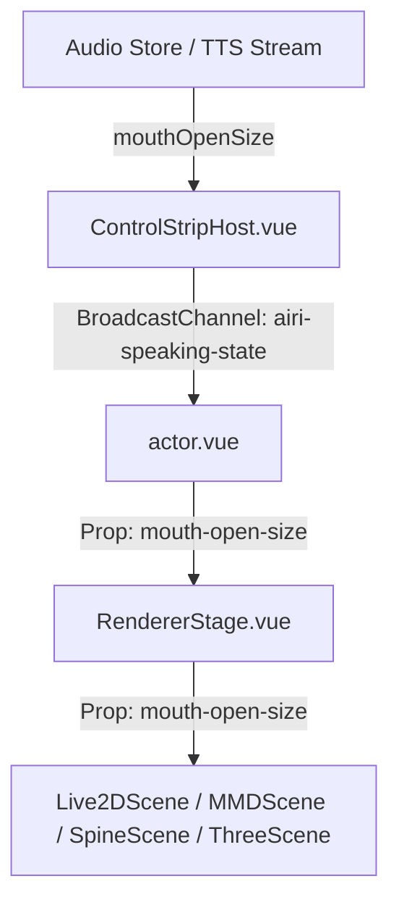
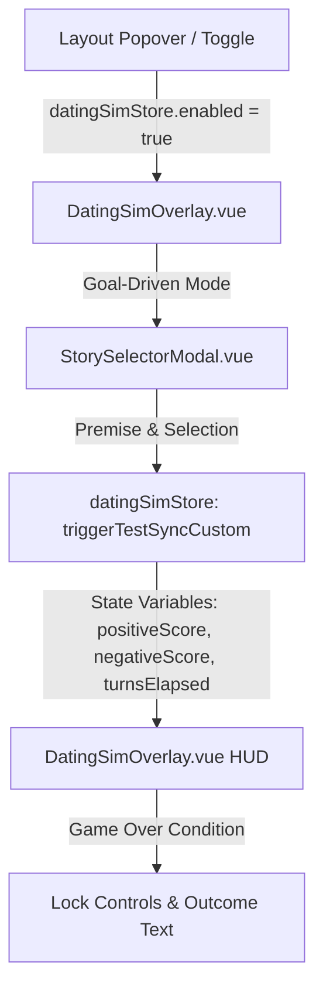
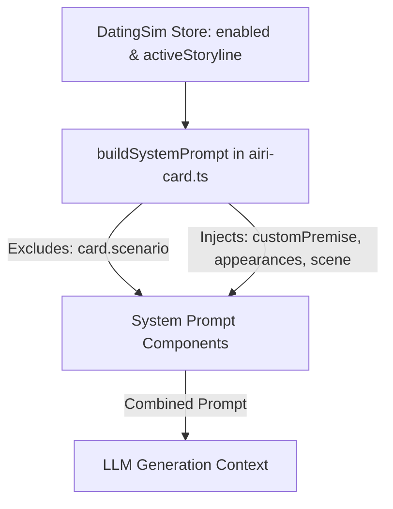
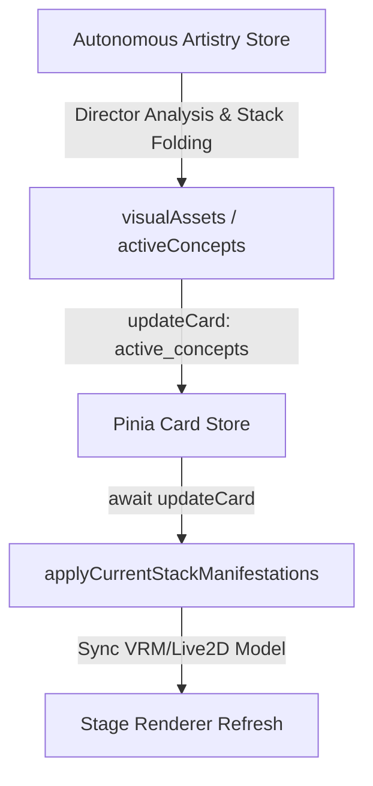

# Rosetta Stone: Speaking & Mouth Synchronization Pipeline

This document maps out the end-to-end data pipeline responsible for capture, broadcast, and rendering of character mouth movement (lip-syncing/speaking) across the AIRI applications.



---

## 1. State Capture (Audio Store)
- **File:** [audio.ts](file:///Users/richardpinedo/Projects.nosync/airi/airi_dasilva333/packages/stage-ui/src/stores/audio.ts)
- **Role:** Tracks TTS audio output and updates the global reactive variable `mouthOpenSize` (range `0.0` to `1.0`) based on live frequency/amplitude analysis during speech.

## 2. Host Window Broadcast
- **File:** [ControlStripHost.vue](file:///Users/richardpinedo/Projects.nosync/airi/airi_dasilva333/packages/stage-ui/src/components/scenes/ControlStripHost.vue)
- **Role:** Watches `mouthOpenSize` and `nowSpeaking` from the speaking store. It broadcasts these values to secondary windows (such as the overlay stage) via the `airi-speaking-state` BroadcastChannel:
  ```typescript
  postSpeakingState({ mouthOpenSize: mouth, nowSpeaking: speaking })
  ```

## 3. Actor Window Broadcast Receiver
- **File:** [actor.vue](file:///Users/richardpinedo/Projects.nosync/airi/airi_dasilva333/apps/stage-tamagotchi/src/renderer/pages/actor.vue)
- **Role:** Subscribes to the `airi-speaking-state` BroadcastChannel and updates local store states when updates arrive, forwarding `mouthOpenSize` as a prop to `<RendererStage>`.

## 4. Stage Router / Propagator
- **File:** [RendererStage.vue](file:///Users/richardpinedo/Projects.nosync/airi/airi_dasilva333/packages/stage-ui/src/components/scenes/RendererStage.vue)
- **Role:** Distributes the `mouthOpenSize` value down to the specific renderer components depending on whether the loaded model is Live2D, VRM (Three), Spine, or MMD.

## 5. Renderers

### A. Spine Scene Renderer
- **File:** [Model.vue](file:///Users/richardpinedo/Projects.nosync/airi/airi_dasilva333/packages/stage-ui-spine/src/components/scenes/spine/Model.vue)
- **Role:** Modifies local bones during the animation update loop:
  ```typescript
  const mouthBone = skeleton.findBone('mouth') || skeleton.findBone('jaw') || skeleton.findBone('mouth_open')
  if (mouthBone) {
    mouthBone.y = mouthBone.data.y - (props.mouthOpenSize * 15)
  }
  ```

### B. MMD Scene Renderer
- **File:** [Model.vue](file:///Users/richardpinedo/Projects.nosync/airi/airi_dasilva333/packages/stage-ui-mmd/src/components/scenes/mmd/Model.vue)
- **Role:** Locates MMD morph indices corresponding to "mouth open", "a", or similar morph keys, and sets their weights dynamically to match `mouthOpenSize`.

### C. VRM (Three.js) Renderer
- **File:** [lip-sync.ts](file:///Users/richardpinedo/Projects.nosync/airi/airi_dasilva333/packages/stage-ui-three/src/composables/vrm/lip-sync.ts)
- **Role:** Blends VRM mouth shapes (A, E, I, O, U) using weighted influences based on audio frequencies.

---

## II. Dating Sim Gamestate & DSL Engine

The Dating Sim is a stateful gameplay overlay operating in two modes (Open-Ended and Goal-Driven) that coordinates dialogue generation, score tracking, and visual settings.



### 1. State Variables & Scoring Metrics
- **File:** [dating-sim.ts](file:///Users/richardpinedo/Projects.nosync/airi/airi_dasilva333/packages/stage-ui/src/stores/dating-sim.ts)
- **Role:** Exposes global refs for `choices`, `currentSubtitle`, `activeStoryline`, and game-state variables inside Pinia:
  - `positiveScore`: Tracked intimacy/score achievements.
  - `negativeScore`: Friction/tension track.
  - `turnsElapsed`: Dynamically calculated from assistant messages in the chat session history.
- **Rules Gating**: Evaluates outcomes when `positiveScore >= maxScore` (Victory) or `negativeScore >= maxScore || turnsElapsed >= maxTurns` (Defeat).

### 2. Campaign Selection & Launch Intercept
- **File:** [StorySelectorModal.vue](file:///Users/richardpinedo/Projects.nosync/airi/airi_dasilva333/packages/stage-ui/src/components/scenes/StorySelectorModal.vue)
- **Role:** Modeless dialog displaying storyboard presets. Allows custom premise adjustments and runs **Producer GD-IT** (Gameshow Host) to generate initial turn choices.

---

## III. Global Context Injection Pipeline

Injects runtime story constraints into the LLM system prompt while filtering out default card parameters to prevent setting collisions.



### 1. Dynamic System Prompt Builder
- **File:** [airi-card.ts](file:///Users/richardpinedo/Projects.nosync/airi/airi_dasilva333/packages/stage-ui/src/stores/modules/airi-card.ts)
- **Role:** When `datingSimStore.enabled` is active, it intercepts the prompt compilation:
  - Excludes the character's native `card.scenario` text to avoid setting conflicts (e.g. bunker vs. gym).
  - Appends the story's `scene` (setting/location), `appearances` (Target Appearance), and cached `customPremise` directly as instruction context.
  - Excludes `termsOfEncounter` to ensure the character's personality is not over-steered, leaving them exclusively as guidelines for choice generation.

---

## IV. Autonomous Artistry & Manifestation Sync Loop

Orchestrates background image generation, concept stack overrides (model swaps, background changes), and ensures immediate layout synchronization.



### 1. Stack Folding & Concept Application
- **File:** [artistry-autonomous.ts](file:///Users/richardpinedo/Projects.nosync/airi/airi_dasilva333/packages/stage-ui/src/stores/modules/artistry-autonomous.ts)
- **Role:** Compiles active visual concepts (outfit layers, base concepts) and folds them bottom-to-top to determine active model overlays (`displayModelId`) and expressions.

### 2. Sequential State Persistence (Hotspot Fix)
- **File:** [ProductionStudioTab.vue](file:///Users/richardpinedo/Projects.nosync/airi/airi_dasilva333/packages/stage-pages/src/pages/settings/airi-card/components/tabs/ProductionStudioTab.vue)
- **Role:** Coordinates the concept toggles. To avoid race conditions where concurrent updates overwrite each other:
  1. `await cardStore.updateCard` writes the new concept array to IndexedDB.
  2. `await autonomousArtistryStore.applyCurrentStackManifestations()` triggers the visual assets model/background updates sequentially.

