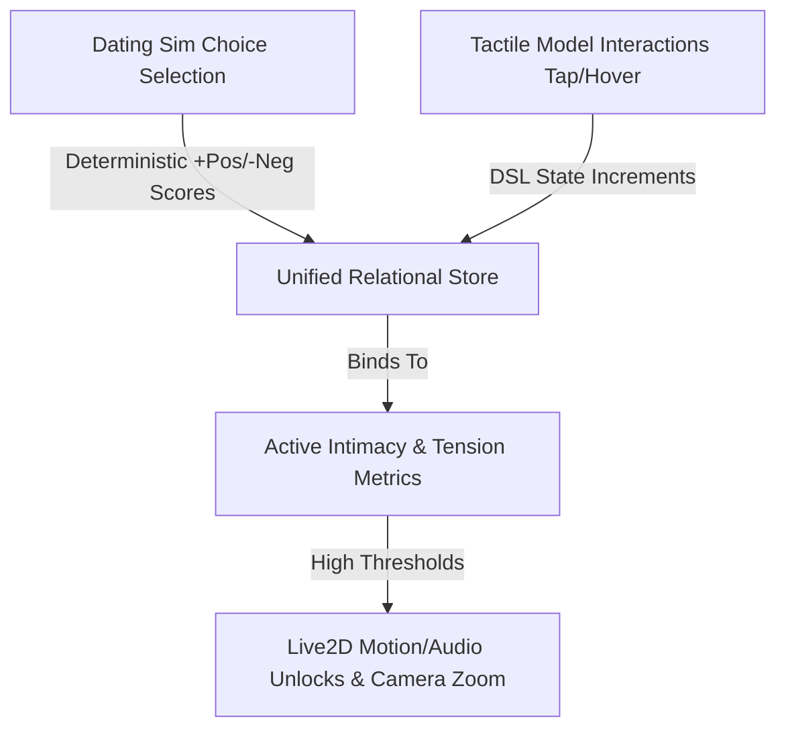

# 🎮 Dating Sim Game State Mechanics & Unified Relational Engine

This document specifies the architecture for porting the **Choice-Effects model** from the legacy game configurations into AIRI's unified Dating Sim mode. It details the alignment of active game loops with Live2D relational unlocks.

---

## 🧭 The Unified Relational Engine

Rather than treating the Dating Sim as an isolated overlay, it runs on a single unified state engine alongside tactile model interactions:



### 1. Active vs. Ambient Mechanics
*   **The Active Loop (Dating Sim)**: Narrative-driven choice selection where the user spends Action Points (AP). Completing a game session triggers final bonuses to the underlying `Intimacy` meter (on a Win) or spikes `Tension` (on a Loss).
*   **The Ambient Loop (Tactile Interaction)**: Secondary, immediate interactions (tapping head, hovering hit zones) that parse DSL scripts inside the character card. Provides smaller, tactile point ticks.

---

## 🎭 State Authority & Mode Segmentation

To keep the system highly flexible and avoid conflict between dynamic LLM evaluation and pre-baked choice metrics, the engine supports two distinct segmented modes:

### 1. Mode A: Open-Ended / Relational Mode (Dynamic sandbox)
*   **Goal**: Cozy sandbox without win/loss conditions.
*   **UI Trigger**: Enforced when using inline chatbox suggestions or when settings.gameMode is set to "open_ended".
*   **Behavior**: The Director/IC dynamically evaluates dialogue post-turn and updates the permanent `Intimacy` and `Tension` variables in real time. Choices do not carry pre-baked score values.
*   **Live2D Sync**: The model's expressions, gaze, and posture adjust on every turn to reflect the fluctuating vibe. No turn limits or session caps exist.

### 2. Mode B: Goal-Driven / Game Mode (Deterministic Interactive Story)
*   **Goal**: Interactive gamified date with clear Win/Loss goals.
*   **UI Trigger**: Activated in the full-screen Dating Sim overlay when settings.gameMode is set to "goal_driven".
*   **Setup**: Requires starting/selecting a **New Session** centered around a preset storyline or custom prompt.
*   **Turn Capping**: The active chat session message count serves as the turn counter (e.g. if the story is set to 8 turns, once `session.messages.length === 8`, the final end turn is hit).
*   **Behavior**: Suggestions are generated with explicit `positiveScore`, `negativeScore`, and `apCost` values.
*   **State Authority**: Real-time variables (`positiveScore`/`negativeScore`) are updated **deterministically** upon choice selection. The Director does NOT update intimacy variables mid-turn, preventing conflicting weights.
*   **Session Resolution**: Upon session completion (when greenlit), the outcome translates to a permanent boost in `Intimacy` (on a Win) or `Tension` (on a Loss).

---

## 🎲 Game Session States & Scoring Models

To support progression, the Dating Sim store tracks the game session metrics alongside the permanent character state:

### 1. Session Variables
*   `positiveScore`: Cumulative points towards a successful date resolution.
*   `negativeScore`: Cumulative points towards a failed date resolution.
*   `turnsElapsed`: Current turn index in the session.
*   `maxTurns`: The maximum turns generated for this session (default: 5-10).
*   `maxScore`: The score threshold required to win or lose the game (default: 10-20).

### 2. Choice Schema (Goal-Driven Game Mode)
In goal-driven game mode, the Producer/Choice Generator response model is adjusted to return weighted choices:

```json
{
  "subtitle": "Character's subtitle/dialogue text for this turn",
  "choices": [
    {
      "text": "Dialogue text in user's voice style",
      "positiveScore": 2,
      "negativeScore": 0,
      "apCost": 1
    },
    {
      "text": "Risky choice option",
      "positiveScore": 1,
      "negativeScore": 2,
      "apCost": 1
    },
    {
      "text": "Wild choice option",
      "positiveScore": 3,
      "negativeScore": 3,
      "apCost": 2
    }
  ]
}
```

---

## 🛠️ The Game Loop Implementation (Debug & Incremental Constraints)

> [!IMPORTANT]
> **Incremental Implementation Rule**: Until explicitly greenlit, all terminal end-turn hooks (win/loss screen triggers) are bypassed. The session loops infinitely, simply incrementing `turnsElapsed` on each turn to allow safe debugging.

### 1. Zero-Inference Parameter Evaluation
When the user clicks a choice in the overlay, the variables are adjusted deterministically:
1.  **Immediate Update**:
    ```typescript
    datingSimStore.setVariable('positiveScore', datingSimStore.getVariable('positiveScore') + choice.positiveScore)
    datingSimStore.setVariable('negativeScore', datingSimStore.getVariable('negativeScore') + choice.negativeScore)
    datingSimStore.setVariable('ActionPoints', datingSimStore.getVariable('ActionPoints') - choice.apCost)
    ```
2.  **No Extra Inferences**: Eliminates the post-choice `evaluateParameters` LLM call, reducing turns to a strict **2-request budget** (Actor response streaming, followed by the background Director/IC choices sweep).

### 2. Choice Weight Debug Mode
We introduce a toggle in the settings ("Show Choice Weights"). When active:
*   Choice buttons in the overlay render the scores inline: `[+2 Pos / -0 Neg] Choice Text...`
*   Helps the user evaluate choices during testing and balancing.
