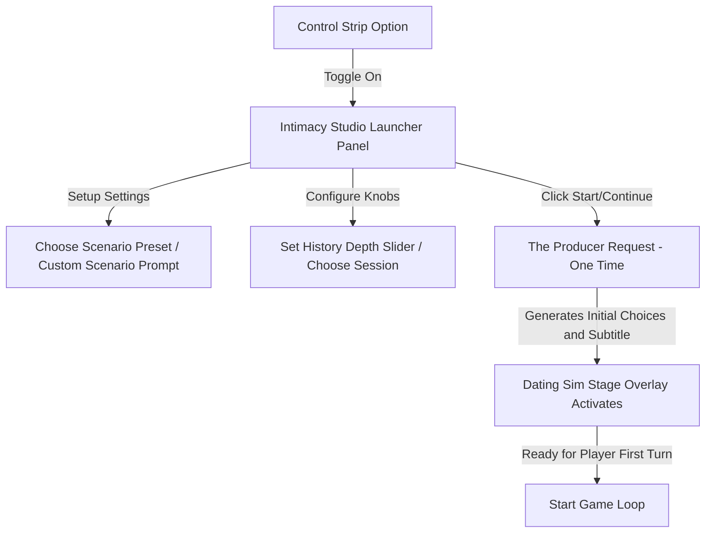
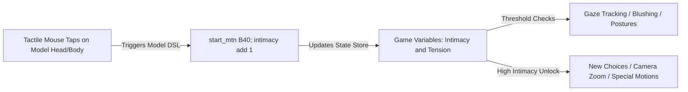

# AIRI Intimacy Engine & Dating Sim Specification (Refined)
### 🌸 A Blueprint for a High-Fidelity, Two-Request Game Loop & State Machine

This specification establishes the architecture for the **Intimacy Engine** in AIRI. It replaces low-fidelity mock patterns with a clean, immersive, two-request pipeline driven by a background orchestrator (the Director/IC) and initialized by a setup agent (the Producer). It outlines the taxonomy, the interaction loops, and the setup sequence.

---

## 🧭 The Core Taxonomy
To align with AIRI's staging and theater production metaphors, the systems are divided into four specific production roles:

| Role | Studio Title | Responsibility | Execution Layer |
| :--- | :--- | :--- | :--- |
| **The Actor** | Scriptwriter | Roleplays as the character. Stays 100% in-character. Generates streaming dialogue and emotional markup tags. | Request 1 (Main Turn) |
| **The Director** | Stage & Scene Manager | Analyzes the scene context post-turn, updates spatial continuity (Scratchpad), and triggers background visual updates (ComfyUI/Flux prompts). | Request 2 (Background) |
| **The Intimacy Coordinator (IC)** | Vibe & State Evaluator | Computes updates to intimacy/tension stats, evaluates AP cost/gating, dispatches facial expression shifts, and scaffolds the next 4 user dialogue options. | Request 2 (Background, Unified with Director) |
| **The Producer** | Scenario & Session Setup | Handles cold-start initialization. Generates the starting choices and scenario subtitle before the game loop starts. | One-time Initialization Request |

---

## 🚨 Core Design Principles (Non-Negotiable)

These are the hard design rules drawn from evaluating existing prototypes:

1. **The Actor must never pull strings.** The Actor's job is to stay 100% in character and generate natural streaming dialogue. It must never be tasked with calling tools, managing game state, or outputting JSON. Injecting game-state directives into the Actor's context breaks immersion and degrades roleplay quality.
2. **The chat history must stay pristine.** No raw developer blocks, no tool invocation JSON, and no meta-directives should appear in the visible chat log. The only evidence of the game engine running should be the sliders animating and the model reacting.
3. **Two requests maximum per turn.** The Actor (Request 1) and the unified Director/IC Sweep (Request 2) represent the entire inference budget per conversational turn. Three or four requests per message is too expensive in latency, cost, and cognitive load.
4. **Choices are written in the user's voice.** Each player option exposes only a short **Title** in the UI (e.g., "Challenge Her"). The underlying **Message** text is a natural, full sentence written exactly as the user would say it. The user can click without reading a prompt - it should feel indistinguishable from typing it themselves.
5. **The game state update prompt lives in the system prompt, not inline.** Instructions for the Director/IC sweep belong in the Director's hardcoded guidance layer (configured in the Artistry/Intimacy tab), not injected per-message. This keeps the chat clean and makes the behavior togglable by simply enabling or disabling the mode.

---

## 📚 Lessons Learned: What the Prototype Got Wrong

The `airi-DSL` demo by `aki-dev-code` (reference commit `e01633fe8`) proved the concept is viable and the overlay UI was a strong visual start. However, the following patterns must be avoided in the full implementation:

| Prototype Behavior | Problem | Correct Pattern |
| :--- | :--- | :--- |
| Actor called `update_dating_sim_variables` tool inline | Broke immersion, interrupted the RP world | Director/IC handles state updates silently in background |
| `(System Note: You MUST use the tool...)` injected into every chat message | Polluted the chat log with developer text | Directive lives in Director's system prompt, toggled by mode |
| Choices sent as raw `[Dating Sim Choice] I want to talk about: X` | Unnatural, felt like scaffolding not speech | Message field contains natural user-voice text; only Title is visible in the button |
| Two separate LLM calls per turn (`evaluateParameters` + `generateLiveChoices`) | Too many inferences, unnecessary latency | Collapsed into single Director/IC background sweep |
| No Live2D DSL parsing; overlay was a floating shell | No physical model integration | IC state variables bind to model gaze, expressions, and idle motion groups |
| "Enable" toggle activated an empty blank overlay | Cold-start problem, no way to begin cleanly | Producer initialization request fires on enable, generates first choices before display |

---

## 🚀 The Setup & Initialization Flow ("The Producer")

To avoid the "blank shell" problem (where toggling the mode leaves the screen empty until mock tests are injected), the initialization process is tightly integrated into the Control Strip:



### 1. Control Strip Entry Point
The toggle is exposed in the **Control Strip Window** as a new dedicated control alongside the existing Actor Stage/Wardrobe controls. Enabling it opens the **Intimacy Studio launcher panel** instead of launching a blank canvas. A standalone icon (e.g. `i-solar:heart-bold-duotone`) next to the existing actor controls is the preferred UX pattern.

> **Why not under AI & Gemini?** This is a staging and character interaction feature, not a provider configuration feature. It belongs visually and conceptually next to the Actor Stage window controls.

### 2. The Setup Launcher UI
The user is presented with the following controls before starting:
* **Session selector:** Select an existing active chat session or start a fresh one.
* **Scenario Context Prompt (Textarea):** Define the theme or emotional framing (e.g., *"We are planning a secret infiltration mission in the rain"*, *"Enemies to lovers in a quiet library after hours"*). This prompt is passed to the Producer as context and wraps around the hardcoded JSON schema to preserve structured output.
* **Context Depth (Slider):** How many past messages ($X$) the Producer reads to ground its initial choice generation. Default: 10. Range: 5-50.
* **Preset Scenarios (Quick Select):** Optional presets that auto-fill the Scenario Prompt textarea (e.g., "Partners in Crime", "Quiet Study Session", "Late Night on the Roof", "Mission Debrief").

### 3. The Producer's One-Time Initialization Prompt
When the session is started, the **Producer** makes a one-time request to compile the initial scenario stage:

```
You are the Producer establishing a Dating Sim scene.
Given the scenario prompt "${scenarioPrompt}" and the last ${X} turns of dialogue, generate:
1. An initial inner thought/subtitle for the character setting the scene.
2. Four starting dialogue options (Title + Message) written exactly in the user's conversational voice.
Output MUST be raw JSON: {"subtitle": "...", "options": [{"title": "...", "message": "..."}]}
```

Once generated, the payload is pushed to the stage overlay. The game state is initialized at default values (Intimacy: 0, Tension: 50, ActionPoints: 5) and the overlay activates with the first four live choices ready for the player.

---

## 🔄 The Game Loop (The 2-Request Flow)

Once the session is active, the engine operates on a strict **two-request turn limit** to preserve latency, token budgets, and narrative immersion.

```
[User Clicks Choice]
  └─ Title: "Ask about hobbies"
  └─ Text: "So, Asuka, what do you do when you aren't piloting anyway?"
         │
         ▼
[1. ACTOR RESPONSE] (LLM Call 1 - Streaming)
  └─ Asuka: "None of your business! ... Fine, I play games. Got a problem with that?"
         │
         ▼
[2. DIRECTOR/IC SWEEP] (LLM Call 2 - Background, fires after Actor completes)
  ├─ Reads: Chat History + Current State + Scratchpad + Scenario Prompt
  └─ Outputs ONE structured JSON payload:
     {
       "visuals": {
         "threshold": 80,
         "prompt": "Asuka's room, gaming console hooked up to a TV, warm sunset",
         "concepts": ["bedroom", "gaming", "sunset"]
       },
       "state_updates": {
         "intimacy_delta": 3,
         "tension_delta": -5,
         "mood": "blush"
       },
       "scratchpad": {
         "spatial_continuity": "Sitting on the edge of the bed, pointing to the TV."
       },
       "player_options": [
         {
           "title": "Challenge Her",
           "message": "I bet I can beat you at any game you've got."
         },
         {
           "title": "Tease Her",
           "message": "Ah, so the elite Eva pilot is just a closet gamer."
         },
         {
           "title": "Ask to watch",
           "message": "Can I watch you play? I want to see how good you are."
         }
       ]
     }
         │
         ▼
[3. UI REACTS] (silent, no chat log pollution)
  ├─ Sliders animate (Intimacy +3, Tension -5)
  ├─ Live2D Model triggers motion from state_updates.mood (e.g. blush expression / crossing arms)
  ├─ ComfyUI starts generating the new background from visuals.prompt in background
  └─ The next choices (using clean Titles only) fade in on the overlay
```

---

## 🎭 The State Machine & Live2D DSL Integration

To achieve visual synchronicity, the variables managed by the **Intimacy Coordinator (IC)** bind directly to the physical Live2D model state, leveraging the model's existing DSL metadata:



1. **Tactile Inputs (Model-Side DSL):**
   When the user interacts with the model (e.g., tapping the head), the stage interpreter parses the custom DSL packaged inside the character card (e.g., `Taphead -> start_mtn B40; Intimacy add 1`). This updates the reactive state store instantly, independent of any LLM request.
2. **State-Driven Model Behaviors:**
   * **Low Intimacy / High Tension:** Restricts head-tracking gaze direction (avoids eye contact), activates defensive idle animations, and locks intimate options behind AP gates.
   * **High Intimacy:** Triggers a subtle camera zoom-in (simulating physical proximity), enables sustained eye contact idle motion, and unlocks specialized dialogue branches.
3. **Director/IC -> Artistry Bridge:**
   The unified Director/IC output's `visuals` block is forwarded directly to the existing **Artistry Bridge** (`artistry-bridge.ts`) pipeline. No additional glue code is needed - the IC payload drops into the same `DirectorNote` structure the existing autonomous artistry system already understands.

---

## 🎨 Artistry & Intimacy Tab: Exposing Scenario Crafting

The **Artistry tab** (or a new sibling **Intimacy tab**) in character card settings should expose a new textarea for the **Scenario Seed Prompt**. This gives the user creative control over the romantic/narrative framing without exposing or breaking the underlying JSON schema.

### Implementation Pattern: Safe Prompt Injection
The hardcoded Director/IC schema wrapper is always preserved. The user's prompt is injected as a variable:

```
[HARDCODED SCHEMA WRAPPER]
  The current intimacy scenario context is: "${userScenarioPrompt}"
  Current state - Intimacy: ${intimacy}/100, Tension: ${tension}/100
  Scratchpad: ${scratchpad}
[HARDCODED OUTPUT REQUIREMENT]
  Output raw JSON only matching this exact schema: { visuals, state_updates, scratchpad, player_options }
```

This pattern:
- Gives users full creative expression over the scenario's emotional theme.
- Guarantees the JSON schema is never broken by user input.
- Makes the system trivially extensible with new persona presets without touching the engine code.

---

## 🏷️ Nickname Catalog

For consistency across code, comments, and documentation:

| Concept | Primary Nickname | Code Identifier |
| :--- | :--- | :--- |
| The roleplay character | **The Actor** | `actor` |
| The background scene and visual orchestrator | **The Director** | `director` |
| The intimacy/tension state evaluator and choice generator | **The Intimacy Coordinator (IC)** | `ic` / `intimacy-coordinator` |
| The one-time session initializer | **The Producer** | `producer` |
| The unified background sweep (Director + IC merged) | **The Director/IC Sweep** | `director-ic-sweep` |
| The player-facing branching overlay | **The Stage Overlay** | `dating-sim-overlay` |
| The DSL-based character interaction state machine | **The Model DSL Engine** | `dsl-engine` |
