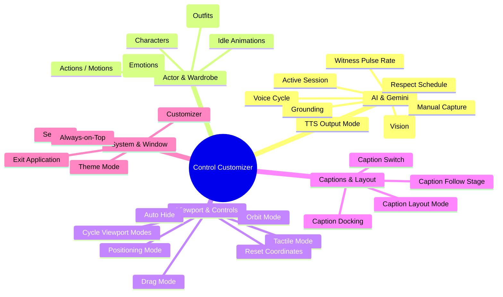

# Control Strip Master Catalog & Feature Specification

A detailed master blueprint cataloging every stage setting, viewport interaction, and AI toggle. This serves as the single source of truth for transitioning all controls from the Controls Island to the Control Strip and Customizer.

---

## 🗂️ The 5 Master Categories

Instead of virtual groups, every button is mapped directly to a logical workspace category. Certain high-utility items across these groups are enabled by default on the Control Strip, while others remain available as add-on macros in the Customizer.

---

## 📋 Comprehensive Feature Specification

### 1. 🪄 AI & Gemini
Toggles, cyclers, and actions governing the active Gemini generative session, vision analysis, and proactive voice behavior.

| Feature Name | Description | Current Icon | Display Type | Default on Strip? |
| :--- | :--- | :--- | :--- | :--- |
| **Active Session** | Connects/disconnects the active Bidi Speech WebSocket session. | `i-ph:broadcast-bold` / `i-ph:sparkle` | Toggle (Switch) | **Yes** (Default on) |
| **Witness Mode (Vision)** | Enables/disables continuous automatic screenshot captures. | `i-solar:eye-scan-bold-duotone` | Toggle (Switch) | No |
| **Manual Capture** | Instantly fires a single manual visual screenshot context capture. | `i-solar:camera-outline` | Action Button | No |
| **Witness Pulse Rate** | Cycles interval duration (5m, 10m, 15m) for automatic witness captures. | `i-ph:heartbeat` | Cycler (Button click rotates) | No |
| **TTS Output Mode** | Swaps output stream between native Gemini audio and custom TTS pipeline. | `i-solar:soundwave-bold` | Toggle (Switch) | No |
| **Voice Cycle** | Cycles through active character text-to-speech output voices. | `i-solar:user-speak-outline` | Cycler (Button click rotates) | No |
| **Respect Schedule** | Enables or bypasses active proactivity schedule constraints. | `i-solar:clock-circle-bold` | Toggle (Switch) | No |
| **Grounding** | Toggles Google Search web context injection on or off. | `i-solar:globus-bold` | Toggle (Switch) | No |

---

### 2. 👤 Actor & Wardrobe
Visual adjustments, expression grids, clothes swapping, and model selections.

| Feature Name | Description | Current Icon | Display Type | Default on Strip? |
| :--- | :--- | :--- | :--- | :--- |
| **Characters** | Swaps active character profile and loads new Live2D/VRM models. | `i-solar:users-group-rounded-outline` | Menu Display (Opens overlay list) | No |
| **Wardrobe (Outfits)** | Swaps visual skins, textures, and outfit configurations. | `i-solar:t-shirt-outline` | Menu Display (Opens overlay list) | No |
| **Expressions (Emotions)**| Triggers persistent emotional and facial expression profiles. | `i-solar:mask-happly-outline` | Menu Display (Opens overlay grid) | No |
| **Idle Animations** | Cycles standard breathing behavior and passive animations loop. | `i-solar:magic-stick-3-bold-duotone` | Cycler (Button click rotates) | No |
| **Actions / Motions** | Plays interactive movements and dynamic body action triggers. | `i-solar:running-2-linear` | Menu Display (Opens overlay grid) | No |

---

### 3. 🕹️ Viewport & Controls
Viewport states, mouse interaction patterns, and coordinate controls.

| Feature Name | Description | Current Icon | Display Type | Default on Strip? |
| :--- | :--- | :--- | :--- | :--- |
| **Tactile Mode** | Pointer click triggers active pokes; character eyes follow cursor. | `i-solar:magic-stick-linear` | Mode Toggle | **Yes** (Part of modes) |
| **Drag Mode** | Mouse click-and-drag moves character; hides sliders for cleanliness. | `i-solar:shuffle-linear` | Mode Toggle | **Yes** (Part of modes) |
| **Positioning Mode** | Activates advanced coordinate placement sliders (X, Y, Scale). | `i-solar:tuning-outline` | Mode Toggle | **Yes** (Part of modes) |
| **Orbit Mode** | Drag rotates camera viewport around VRM/3D model environments. | `i-solar:eye-linear` | Mode Toggle | **Yes** (Part of modes) |
| **Cycle Viewport Modes**| Cycles sequentially through the four pointer interaction modes above. | `i-solar:refresh-linear` | Cycler (Button click rotates) | No |
| **Reset Coordinates** | Instantly resets X, Y, and Scale parameters to character defaults. | `i-solar:restart-square-outline` | Action Button | No |
| **Auto Hide / Always Show** | Toggles whether control island / stage UI elements auto-fade on mouse leave. | `i-ph:eye-slash` | Toggle (Switch) | No (Default off) |

---

### 4. 💬 Captions & Layout
Subtitles, captions overlay styling, and attaching/docking properties.

| Feature Name | Description | Current Icon | Display Type | Default on Strip? |
| :--- | :--- | :--- | :--- | :--- |
| **Captions Toggle** | Toggles visibility of the caption subtitles overlay. | `i-ph:closed-captioning-duotone` | Toggle (Switch) | **Yes** (Default on) |
| **Caption Docking** | Swaps caption overlay attachment location (Top vs Bottom). | `i-solar:align-bottom-line-duotone` | Toggle (Switch) | No |
| **Caption Follow Stage**| Toggles if the caption overlay follows Stage coordinates or stays detached. | `i-solar:magnet-bold-duotone` | Toggle (Switch) | No |
| **Caption Layout Mode** | Cycles subtitle display layout (Standard Bubble vs Multi-line History). | `i-solar:window-frame-linear` | Cycler (Button click rotates) | No |

---

### 5. 🔌 System & Window
Window alignments, presets, diagnostics, and application management.

| Feature Name | Description | Current Icon | Display Type | Default on Strip? |
| :--- | :--- | :--- | :--- | :--- |
| **Settings** | Opens the main configuration settings menu pane. | `i-solar:settings-linear` | Action Button | **Yes** (Default on) |
| **Customizer** | Toggles visibility of this Control Customizer configuration window. | `i-solar:widget-linear` | Action Button | **Yes** (Default on) |
| **Always-on-Top** | Toggles window floating status above full-screen applications. | `i-solar:pin-linear` | Toggle (Switch) | **Yes** (Default on) |
| **Theme Mode** | Swaps light/dark application color themes. | `i-solar:sun-linear` / `i-solar:moon-linear` | Toggle (Switch) | **Yes** (Default on) |
| **Exit Application** | Clean-quits and shuts down the active AIRI process cycle. | `i-solar:close-circle-outline` | Action Button | **Yes** (Default on) |
