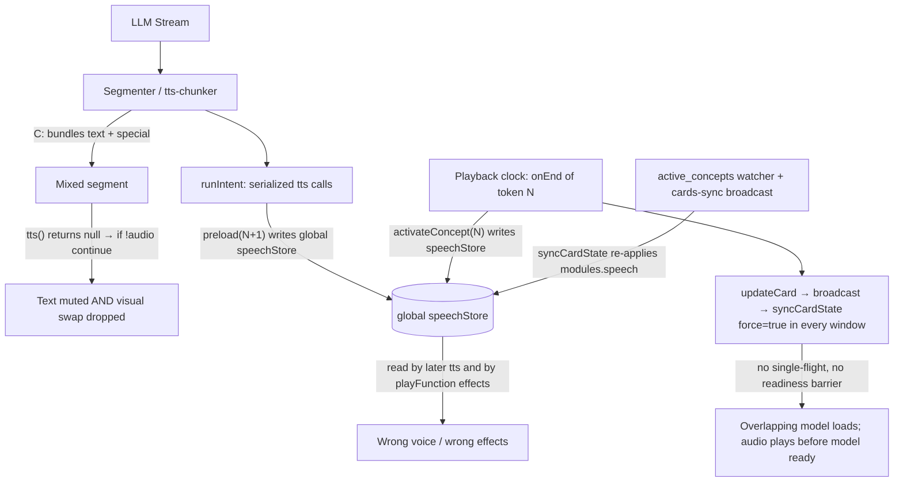

# Engineering Journal: Root Cause Analysis & Architectural Rework for `<|ACTOR:|>` Token Sync

This document serves as the canonical diagnostics journal and architectural design record for resolving the timing, synchronization, and text-swallowing bugs associated with the `<|ACTOR:|>` swap tokens.

---

## 1. Executive Summary

The `<|ACTOR:actor_id|>` tokens are designed to orchestrate real-time actor and voice swaps during character dialogue. Currently, the system fails to execute these swaps cleanly more than 50% of the time. The symptoms include:
*   **Voice switching too early or too late** (audio segments spoken in the wrong voice).
*   **Desynchronized visual swaps** (the new voice begins playing before the 3D VRM/Live2D model has finished loading and rendering).
*   **Text swallowing/muting** (entire words or sentences immediately preceding an actor token are completely omitted from the audio output).
*   **Sloppy, erratic swapping** during rapid back-and-forth dialogue.

This journal outlines the verified root causes, additional pipeline defects, and a robust architectural rework plan to stabilize the system.

---

## 2. Root Cause Analysis & Diagnostic Trace

The timing failures sit at the intersection of streaming parsing, audio synthesis, and playback rendering. The verified failure-flow diagram is as follows:

### Root Cause A: Global State Pollution & Clock Skew
*   **Primary Files:**
    *   `packages/stage-ui/src/components/scenes/ControlStripHost.vue` (TTS logic)
    *   `packages/stage-ui/src/stores/modules/artistry-autonomous.ts` (`preloadConceptVoice` / `activateConcept`)
    *   `packages/stage-ui/src/stores/modules/airi-card.ts` (`syncCardState` / `active_concepts` watcher)
*   **The Misdiagnosis:** The timing issue is not caused by asynchronous preloading racing with generation inside a single intent (TTS calls are strictly serialized inside `runIntent()` in `packages/pipelines-audio/src/speech-pipeline.ts:93-188`).
*   **The Real Race:** The generation clock runs significantly ahead of the playback clock (which drains audio buffers at speaking speed). Two writers compete to mutate the global `speechStore` on different schedules:
    1.  **Generation Clock:** `preloadConceptVoice(N+1)` writes the voice for the *upcoming* actor to the global store.
    2.  **Playback Clock:** When actor token *N*'s null-audio playback item finishes, `playbackManager.onEnd` triggers `activateConcept(N)`, which **stamps the global voice settings back** to *N*.
    3.  **Watcher Clock:** `activateConcept` writes to the card store, triggering the deep watcher on `active_concepts` which asynchronously invokes `syncCardState(force=true)` in every window. This watcher **re-applies** `modules.speech.*` to the global store, stomping the generation-time preload again.
*   **Result:** The voice swap gets **reverted** back to the previous actor's settings when the playback or watcher clock catches up with generation, resulting in late or skipped swaps. Furthermore, `playFunction()` reads `activeSpeechProvider`/`activeSpeechVoice` at playback time to choose effects and pitch. Even if the buffer itself was synthesized correctly, the wrong actor's effect chain/pitch is applied.

### Root Cause B: Playback vs. Visual Loading Latency Gap
*   **Primary File:** `packages/stage-ui/src/components/scenes/ControlStripHost.vue` (under `playbackManager.onEnd` and `playSpecialToken()`)
*   **Mechanism:** Pure actor tokens carry `audio: null` and complete instantly in the playback queue. The playback manager immediately fires `onEnd` and moves to the next audio segment.
*   **The Flaw:** When the token finishes, it initiates `activateConcept(actorId)` asynchronously. This updates the card, triggers the watcher, and kicks off `syncCardState` -> `updateStageModel` / `shouldUpdateView`. In Electron, the model reloads in a separate actor window (`apps/stage-tamagotchi/src/renderer/pages/actor.vue`), adding broadcast latency on top of the 2–5 second WebGL load time. There is no synchronization barrier in the playback queue to block audio until the new model is loaded and ready.
*   **Result:** Actor B's audio plays immediately while Actor A's model is still rendering on screen.

### Root Cause C: Text-Swallowing / Muting Bug in Chunker
*   **Primary File:** `packages/pipelines-audio/src/processors/tts-chunker.ts` (under `chunkTtsInput()`)
*   **Mechanism:** If text exists in the buffer when a special token is parsed (e.g. `"Hello <|ACTOR:character_b|>"`), `chunkTtsInput()` yields a mixed `TextSegment` carrying both `text: 'Hello'` and `special: '<|ACTOR:character_b|>'`.
*   **The Flaw:**
    1.  In `speech-pipeline.ts`, the special-token branch requires `value.text === ''`, so this mixed segment falls through to the normal TTS generation path.
    2.  In `ControlStripHost.vue`, the `tts()` handler checks for `request.special` before text and returns `null` immediately.
    3.  Because `tts()` returns `null`, the segment is **never scheduled** for playback (`if (!audio) continue` in `speech-pipeline.ts:161-162`).
*   **Result:** The preceding text `"Hello"` is completely swallowed (never synthesized). More critically, because the segment is dropped entirely, the actor token **never reaches the playback queue**, meaning the visual model/background swap for that token is silently dropped.

### Root Cause D: Unserialized Model-Sync Workloads
*   **Primary File:** `packages/stage-ui/src/stores/modules/airi-card.ts` (under `syncCardState`)
*   **Mechanism:** Card writes invoke `persistCards()`, which broadcasts `airi:cards-sync` to all windows. This triggers `syncCardState(card, force=true)` concurrently in each window.
*   **The Flaw:** `syncCardState` is asynchronous and has no single-flight guard. Consecutive actor swaps trigger rapid, overlapping model loads with interleaved awaits in both the main window and the actor window, causing WebGL contexts to clash, abort, or freeze. Note that this is not a broadcast loop (as card loading does not re-broadcast), but rather concurrent forced synchronizations.

---

## 3. Additional Pipeline Defects Found

During code validation, the following additional issues were identified:
1.  **Dead Event Listener:** `speechPipeline.on('onSpecial', ...)` in `ControlStripHost.vue:646-649` is dead code. The pipeline never emits the `onSpecial` event because the underlying `speechSpecialEvent` in `eventa.ts` is never triggered. The `(parser)` label on the `'actor'` handler is misleading; it runs exclusively at playback time via `playbackManager.onEnd`.
2.  **Dual Personality of `activateConcept`:** This store method handles both visual stack updates (correct for playback clock) and speech runtime updates (which pollute the generation clock).
3.  **Delayed Speech Watchers:** The `active_concepts` watcher in `airi-card.ts` asynchronously updates `modules.speech` on the global store after every card write, acting as a third delayed writer that stomps the generation clock.
4.  **Implicit Mixed Segment Types:** `TextSegment` types allow both `text` and `special` properties, but the pipeline only has logic to handle them separately, discarding the data when both are present.

---

## 4. Proposed Architectural Rework (Refined Plan)

To resolve the synchronization issues, the following sequence of changes is proposed:

### Phase 1: Chunker Isolation & Pipeline Safeguards (Eliminate Mutes/Drops)
*   **Isolate Specials:** Modify `packages/pipelines-audio/src/processors/tts-chunker.ts:141-155` so that when a `TTS_SPECIAL_TOKEN` is hit, it immediately flushes any active buffer text as a pure `literal` chunk, then emits an empty `special` chunk.
*   **Defensive Branching:** Update `packages/pipelines-audio/src/speech-pipeline.ts` to assert that segments are strictly typed, or defensively split any mixed text+special segments so that text is synthesized and specials are queued separately.
*   **Unit Testing:** Add Vitest tests in `packages/pipelines-audio` validating segment chunking for mixed patterns (e.g. `"Hello <|ACTOR:b|>"`, `"<|ACTOR:a|>Hi<|ACTOR:b|>"`).

### Phase 2: Metadata-Driven Scoped Synthesis (Fix State Pollution)
*   **Segment Actor Tagging:** Tag every `TextSegment` with an `actorId` during segmentation.
*   **Segment-Level TTS Resolution:** In `ControlStripHost.vue`'s `tts()`, resolve the specific TTS voice, model, and provider settings from the segment's `actorId` dynamically (using `resolveConceptStack` and `foldConceptStack` as pure functions). Do not read from the global `speechStore` at generation time.
*   **Eliminate Preloaders:** Delete `preloadConceptVoice()` entirely.
*   **Scoped Playback Effects:** Attach the resolved voice profile and effects settings directly to the `PlaybackItem` so `playFunction()` does not read global state at playback time.
*   **Remove Speech Writes from Visual Swaps:** Remove speech-store writes from `activateConcept()` and from the `syncCardState` card watcher. The global `speechStore` should only mirror the *currently playing* actor (written from `playbackManager.onStart`).

### Phase 3: Playback Barrier & Model Prefetching (Fix Timing/Loading Desync)
*   **Awaitable Barrier in `playFunction`:** The playback manager serializes audio segments (`maxVoices: 1`). Instead of introducing complex queue pause/resume states, make the special item's `play()` handler block by awaiting `activateConcept(actorId)` and a model-ready promise (with a 5–8 second timeout fallback). The queue blocks naturally without risk of freezing on interrupt.
*   **Generation-Time Model Prefetching:** When a special actor segment passes through the generation phase (where the preload used to be), kick off a non-mutating prefetch command to load and cache the visual assets (model files/textures) in the browser/electron cache. By the time playback reaches the token, the model swap will resolve in milliseconds.

### Phase 4: Single-Flight Model Sync (Fix Concurrency Collisions)
*   **Sync Cancellation:** Implement an `AbortController` or generation counter in `packages/stage-ui/src/stores/modules/airi-card.ts`'s `syncCardState` to automatically cancel any in-flight model loads when a new transition is requested.

---

## 5. Reference File Manifest (Verified Line Numbers)

| Concern | File | Lines |
|---|---|---|
| Serialized segment loop, empty-special branch, `if (!audio) continue` | `packages/pipelines-audio/src/speech-pipeline.ts` | 93–188, 106, 161–162 |
| Text+special bundling | `packages/pipelines-audio/src/processors/tts-chunker.ts` | 141–155, 229–233 |
| `tts()` special short-circuit, global voice reads, playback effects reads | `packages/stage-ui/src/components/scenes/ControlStripHost.vue` | 503–513, 522–524, 414–427 |
| Dead `onSpecial` listener; `'actor'` queue handler | `packages/stage-ui/src/components/scenes/ControlStripHost.vue` | 646–649, 280–284, 651–680 |
| Null-audio instant completion | `packages/stage-ui/src/components/scenes/ControlStripHost.vue` / `packages/pipelines-audio/src/managers/playback-manager.ts` | 393–394 / 126–147 |
| `activateConcept` speech writes; `preloadConceptVoice` | `packages/stage-ui/src/stores/modules/artistry-autonomous.ts` | 981–987, 1026–1065 |
| cards-sync broadcast, reload, `active_concepts` watcher, forced `syncCardState` speech/model sync | `packages/stage-ui/src/stores/modules/airi-card.ts` | 285–304, 333–340, 480–547 |
| Actor window renderer (no playback queue) | `apps/stage-tamagotchi/src/renderer/pages/actor.vue` | 6, 261 |

---

## 6. Related System Documentation & Proposals
*   **[`docs/rosetta-stone.md`](file:///Users/richardpinedo/Projects.nosync/airi/airi_dasilva333/docs/rosetta-stone.md)**: Master structural routing sheet for monorepo pathways.
*   **[`docs/proposal-visual-state-outfit-hook.md`](file:///Users/richardpinedo/Projects.nosync/airi/airi_dasilva333/docs/proposal-visual-state-outfit-hook.md)**: Architecture spec for Director-led modular visual assets.
*   **[`docs/proposal-visual-state-outfit-hook-implementation-plan.md`](file:///Users/richardpinedo/Projects.nosync/airi/airi_dasilva333/docs/proposal-visual-state-outfit-hook-implementation-plan.md)**: Implementation checkpoints and test protocols.
*   **[`docs/content/en/docs/advanced/architecture/design-acting-tab-and-chatterbox.md`](file:///Users/richardpinedo/Projects.nosync/airi/airi_dasilva333/docs/content/en/docs/advanced/architecture/design-acting-tab-and-chatterbox.md)**: Spec for prompt acting behaviors and capabilities payload mappings.
