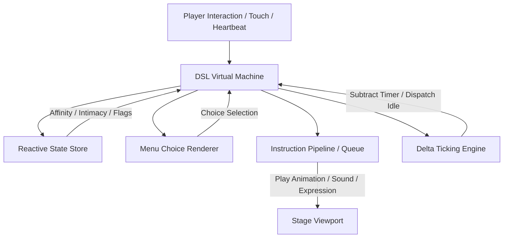
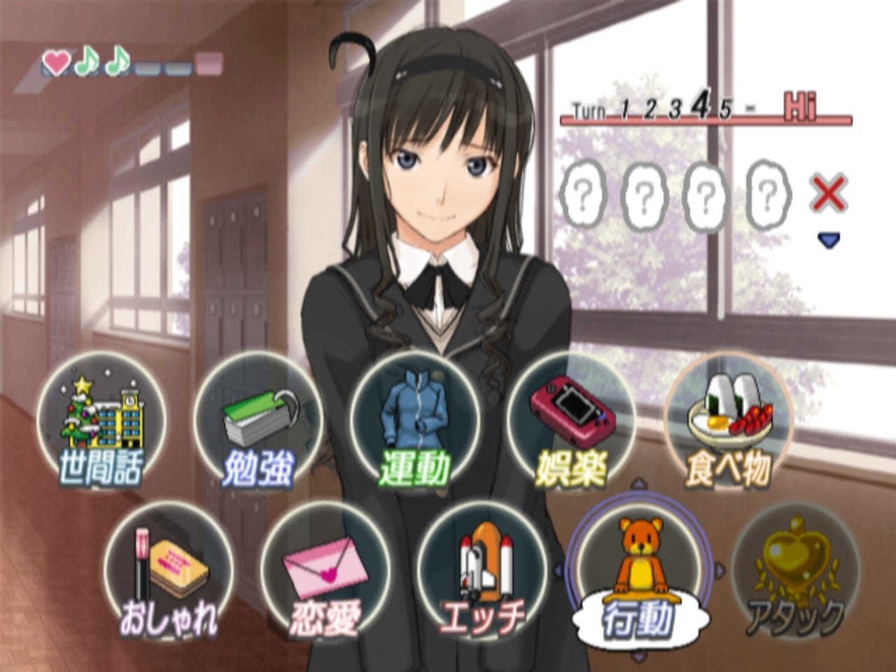

# Live2D DSL Interpreter & Dating Sim Specification
### 🌸 A Blueprint for Natively Integrating Live2D Creator Scripting & Generative Staging in AIRI

This specification outlines the architecture for a generic, stateful **Live2D DSL Interpreter** in AIRI. By parsing and executing the custom interactive scripting embedded within advanced third-party Live2D manifests, AIRI can natively run complex visual novels, RPG systems, affinity gating, and dynamic dialogue menus.

Additionally, this document defines the **Dating Sim Blend Vision**: a premium, single-window UX where branching choices and high-fidelity Live2D characters are seamlessly composed onto generative AI-rendered backgrounds (via ComfyUI/Flux) without distracting window spawns or breaking UI immersion.

---

## 🧭 The Core Architecture

The interpreter behaves as an event-driven virtual machine that maps custom metadata onto AIRI's physical rendering, audio playback, and LLM orchestration layers. It consists of **five core modules**:



---

## 1. The Stateful Reactive Store (`VarFloats` Engine)
The engine maintains a local, reactive memory heap containing user variables, intimacy points, system flags, and timers.

### Schema Spec & Parsing
`VarFloats` lists represent logic operations. They are split into two categories:
*   **Type 1 (Conditional Guards):** e.g., `{"Name": "stop", "Type": 1, "Code": "equal 1"}`. Acts as a guard clause. If the condition fails, the candidate interaction is discarded.
*   **Type 2 (State Modifiers):** e.g., `{"Name": "ChatTimer", "Type": 2, "Code": "assign rand(20,25)"}` or `{"Name": "Affinity", "Type": 2, "Code": "add 15"}`. Mutates state.

### JavaScript Implementation Concept
```typescript
interface VarFloat {
  Name: string
  Type: 1 | 2 // 1 = Condition, 2 = Assignment
  Code: string
}

class ReactiveStore {
  private variables: Map<string, number> = new Map()

  evaluateCondition(condition: VarFloat): boolean {
    const currentValue = this.variables.get(condition.Name) || 0
    const [op, targetStr] = condition.Code.split(' ')
    const target = Number.parseFloat(targetStr)

    switch (op) {
      case 'equal': return currentValue === target
      case 'greater': return currentValue > target
      case 'less': return currentValue < target
      default: return false
    }
  }

  executeAssignment(modifier: VarFloat): void {
    const currentValue = this.variables.get(modifier.Name) || 0
    const code = modifier.Code

    if (code.startsWith('assign')) {
      const expr = code.replace('assign ', '')
      if (expr.startsWith('rand(')) {
        const [min, max] = expr.match(/\d+/g)!.map(Number)
        this.variables.set(modifier.Name, Math.floor(Math.random() * (max - min + 1)) + min)
      }
      else {
        this.variables.set(modifier.Name, Number.parseFloat(expr))
      }
    }
    else if (code.startsWith('add')) {
      const delta = Number.parseFloat(code.replace('add ', ''))
      this.variables.set(modifier.Name, currentValue + delta)
    }
    else if (code.startsWith('subtract')) {
      const delta = Number.parseFloat(code.replace('subtract ', ''))
      this.variables.set(modifier.Name, currentValue - delta)
    }
  }
}
```

---

## 2. The Branching Choice Overlay (`Choices` Engine)
Instead of launching dialog menus that detach the player from the character, interactive choices are compiled and rendered as **vibrant, floating glassmorphic buttons** composed directly on top of the stage background.

```
+-------------------------------------------------------------+
|                                                             |
|                          Live2D                             |
|                        Character                            |
|                                                             |
|              +-----------------------------+                |
|              |      [ 🎁 Give a Gift ]     |                |
|              +-----------------------------+                |
|              |   [ 💬 Chat (Intimacy 5+) ] |                |
|              +-----------------------------+                |
|                                                             |
+-------------------------------------------------------------+
```

### UX Design Specs
*   **Vibrant Glassmorphism:** CSS backdrop-filter (`blur(12px) saturate(180%)`), subtle border gradients, and light-reflecting hover micro-animations.
*   **Dynamic Parsing:** If a choice contains dynamic template tags like `{$vi_IntimacyVI}`, the text is compiled on the fly using active variables before rendering.
*   **Next-State Routing:** Clicking a choice triggers the associated `NextMtn` state in the Instruction Pipeline.

---

## 3. The Instruction Sequencer (`Command` Pipeline)
Many advanced creator triggers chain animations, voice files, expressions, and toggles into a single line. The Sequencer parses this custom instruction set and runs them in order.

### Common Instructions to Parse
*   `start_mtn <GroupName>:<ItemIndex>`: Triggers a physical motion and matches it with sound overlays on dedicated tracks.
*   `clear_exp`: Clears persistent expressions to restore base face.
*   `motions enable/disable <GroupName>`: Sets a feature flag blocking certain idle triggers (e.g., stops idle blinking or breathing during complex scripts).
*   `mouse_tracking enable/disable`: Enables or disables 3D eye-gaze and head-tracking when interacting with choice menus.
*   `change_cos <ModelJson>`: Swaps the active Live2D costume or model manifest dynamically without destroying the canvas viewport or resetting user variables (essential for multi-model packages like Senran Kagura standby collections).

### Pipeline Execution Flow
When a command is received (e.g., `start_mtn B10;start_mtn Sound#1:voice_01;start_mtn Face#2:07;clear_exp`), the parser:
1.  Splits the command string by `;`.
2.  Maps `start_mtn` to the specific audio and motion layers.
3.  Injects the target expression ID into standard `pixi-live2d-display` components.
4.  Optionally pauses the primary Idle heartbeat loop until the script finishes.

### Dynamic Model Hot-Swapping (`change_cos` Pipeline)
When a creator triggers a costume or character swap via `change_cos model_x.json` (such as in standby character collections), the interpreter must perform a zero-latency hot-swap:
1.  **State Preservation:** Keeps the reactive variable heap (`VarFloats`) intact, preserving affinity, timers, and flags.
2.  **Resource Pre-loading & Switch:** Fetches and parses the target `model_x.json`. It loads the new `.moc3` and associated textures into WebGL memory.
3.  **Viewport Crossfade:** Swaps the renderable model instance inside the `pixi-live2d-display` application container. A smooth alpha fade-out and fade-in can be applied to the canvas to make the swap visually seamless.

#### JavaScript Implementation Concept:
```typescript
class Live2DStageManager {
  private activeModel: any = null
  private app: any // PIXI.Application

  constructor(app: any) {
    this.app = app
  }

  async changeCostume(modelJsonPath: string): Promise<void> {
    console.log(`🎭 Dynamic Costume Swapping triggered: ${modelJsonPath}`)

    // 1. Locate the resource in the current folder / package context
    const fullPath = this.resolvePath(modelJsonPath)

    // 2. Perform smooth fade-out animation
    if (this.activeModel) {
      await this.animateAlpha(this.activeModel, 0, 200) // 200ms fade-out
      this.app.stage.removeChild(this.activeModel)
      this.activeModel.destroy()
    }

    // 3. Load the new model definition
    const newModel = await Live2DModel.from(fullPath)
    newModel.alpha = 0

    // 4. Mount the new model and trigger a smooth fade-in
    this.activeModel = newModel
    this.app.stage.addChild(newModel)
    await this.animateAlpha(newModel, 1, 200) // 200ms fade-in

    console.log(`✅ Dynamic model hot-swap complete: ${modelJsonPath}`)
  }

  private resolvePath(path: string): string {
    // Custom folder / zip file path resolver
    return path
  }

  private animateAlpha(model: any, targetAlpha: number, duration: number): Promise<void> {
    return new Promise((resolve) => {
      const startTime = performance.now()
      const startAlpha = model.alpha

      const tick = (now: number) => {
        const elapsed = now - startTime
        const progress = Math.min(elapsed / duration, 1)
        model.alpha = startAlpha + (targetAlpha - startAlpha) * progress

        if (progress < 1) {
          requestAnimationFrame(tick)
        }
        else {
          resolve()
        }
      }
      requestAnimationFrame(tick)
    })
  }
}
```

---

## 4. The RPG Intimacy Gating System
Affinity scores are read directly from persistent user profiles to unlock secret voice lines, outfits, and responses.

```json
{
  "Intimacy": {
    "Min": 27450,
    "Max": 50000,
    "Bonus": 300
  },
  "Weight": 4,
  "NextMtn": "HappyReaction"
}
```

*   **Intimacy Gating (`Min` / `Max`):** The interaction will only be evaluated as a valid option if the user's saved intimacy fits within the bounds.
*   **Affinity Rewards (`Bonus`):** Successfully triggered positive outcomes (like choosing the correct dialogue or presenting the correct gift) reward the player's profile by adding affinity points directly to their persistent store.
*   **Dynamic Fallbacks:** If a high-level touch area is clicked but the player's affinity is too low, the system falls back to a custom warning dialog (e.g., *"We need to spend more time together to unlock this..."*).

---

## 5. The Delta Ticking Engine (Auto-Ticks & Heartbeats)
The character shouldn't be static between clicks. Background delta timers run continuously, decrementing values, calculating chat frequencies, and auto-dispatching animations.

*   **Delta Loops:** A ticking loop (running every `500ms` to `1000ms`) automatically subtracts delta times from countdown variables:
    `ChatTimer = ChatTimer - deltaTime`
*   **Heartbeat Triggers:** Once `ChatTimer <= 0`, the engine rolls a random number, selects an appropriate conversational nudge (e.g., checking system load or time of day), triggers the physical idle motion, and re-initializes the timer:
    `ChatTimer = rand(20,25)`

---

## 🎬 The Dating Sim Blend Vision
This is the **next-level visual-novel staging paradigm** that maps these Live2D mechanical features onto a premium generative AI aesthetic.

```
+-------------------------------------------------------------+
|  [ Generative AI Background (ComfyUI / Flux Scene) ]        |
|                                                             |
|                    +------------------+                     |
|                    |     Live2D       |                     |
|                    |    Character     |                     |
|                    |                  |                     |
|                    +------------------+                     |
|                                                             |
|  +-------------------------------------------------------+  |
|  | [ Dialogue Overlay (Subtitles & Dynamic Variables) ]  |  |
|  +-------------------------------------------------------+  |
|                                                             |
|             +----------------------------------+            |
|             |      Branching Choices composed  |            |
|             |       onto background overlay    |            |
|             +----------------------------------+            |
+-------------------------------------------------------------+
```

### The Staging Concept:
1.  **AI Background Fusion:** The stage background isn't a static image. It is dynamically generated and updated on the fly using **AIRI's Artistry Concept Stack**.
    *   *Example:* If the dialogue progresses to a "Rainy Cafe," the concept is pushed to the stack. The background is regenerated in real-time with rainy glass window reflections, and the Live2D model adjusts its lighting filter and outfit accordingly.
2.  **Zero-Window Immersive UI:** Traditional dating sims rely on disjointed pop-up overlays, navigation bars, and setting tabs. The **Dating Sim Blend** keeps everything layered within a single 3D Canvas.
    *   Choices and subtitles appear directly on top of the dynamic background layer.
    *   The dialogue text dynamically interpolates parameters from the `VarFloats` store (such as player name, current intimacy, time of day, and location).
3.  **Physical/Expressive Synchronicity:** When a text bubble appears, the script dispatcher coordinates the physical Live2D reaction (e.g. embarrassment cheeks blushing + eye-roll motion) and overlays the pre-recorded voice line instantly. If voice-generation is active, it runs speech-to-text token mappings to keep the lips sync'd natively.

## Implementation Plan
1. **A settings menu with all of the preferences related to the DSL system:** Made for Users who want to customize their DSL experience. "Dating Sim Preferences" is a suitable name foe this feature.
2. **A Zero-Window Immersive UI:** The UI would be preferred to be made as described above. But for a clear representation, you can take these interfaces as a reference
+-------------------------------------------------------------+
|                                                             |
|                          Live2D                             |
|                        Character                            |
|                                                             |
|              +-----------------------------+                |
|              |      [    Give a Gift ]     |                |
|              +-----------------------------+                |
|              |   [    Chat (Intimacy 5+) ] |                |
|              +-----------------------------+                |
|                                                             |
+-------------------------------------------------------------+


|  [ Generative AI Background (ComfyUI / Flux Scene) ]        |
|                                                             |
|                    +------------------+                     |
|                    |     Live2D       |                     |
|                    |    Character     |                     |
|                    |                  |                     |
|                    +------------------+                     |
|                                                             |
|  +-------------------------------------------------------+  |
|  | [ Dialogue Overlay (Subtitles & Dynamic Variables) ]  |  |
|  +-------------------------------------------------------+  |
|                                                             |
|             +----------------------------------+            |
|             |      Branching Choices composed  |            |
|             |       onto background overlay    |            |
|             +----------------------------------+            |
+-------------------------------------------------------------+

Avoid using emojis and try to opt for SVGs.

You can also take this as a reference(source: Amagami)

**Make this concept a reality. Sky is truely the limit**
