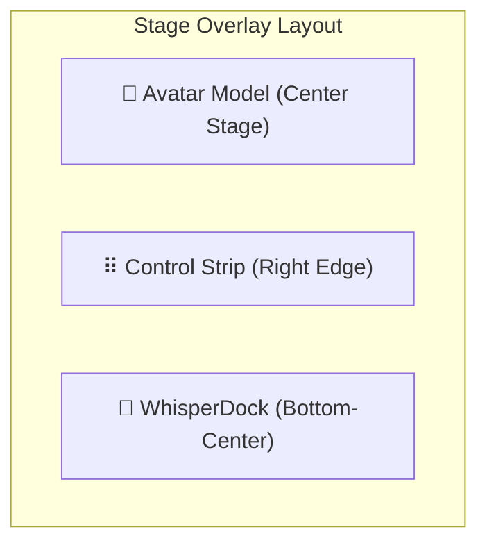

# RFC: Customizable Control Strip Revamp

A comprehensive design specification for transitioning the AIRI layout from the grid-heavy **Control Island** and scattered **Gemini Controls** to a unified, minimal, customizable **Control Strip** (Ribbon).

---

## 👁️ Visual & Concept Mockup

The **Control Strip** is a floating glassmorphic pill located at the right edge of the stage overlay, designed to minimize visual clutter while exposing critical root-level actions with rich responsiveness.

The stage window layout itself is completely decluttered—featuring ONLY the **Avatar model**, the **Control Strip floating on the right**, and a spacious **WhisperDock at the bottom-center** for casual typing.



---

## 🎯 Core Objectives & Engineering Enhancements

### 1. Architectural Decoupling: Pure Stage vs. Control Strip
Historically, `Stage.vue` has served a dual purpose: acting as both the visual model renderer and the designated background communications hub (handling audio analysis, speech runtime registration, broadcast channels, and logistics).

To effectuate a clean, modular design, we will **decouple the control/comms layer from the pure rendering layer**:
- **`ControlStripHost.vue` (The Host / Comms Hub):** This component (renamed from `Stage.vue`) becomes the top-level orchestrator. It manages Pinia stores, Electron IPC bridges, broadcast channels, and overlays the modular Control Strip floating pill.
- **`Stage.vue` (The Pure Renderer):** Stripped of background communication bloat. It becomes a lightweight, pure rendering container that simply receives reactive props (model, coordinate offsets, scale, lip sync triggers) and draws the avatar.

```mermaid
graph LR
    subgraph ControlStripHost.vue (Host & Comms Hub)
        B1[Broadcast Channels]
        B2[Audio Analyser & LipSync]
        B3[Floating Control Strip Pill]
    end

    subgraph Stage.vue (Pure Renderer)
        C1[Live2D Canvas]
        C2[VRM / ThreeJS Scene]
        C3[Spine / MMD Scene]
    end

    ControlStripHost.vue -->|Passes offset, scale, state props| Stage.vue
```

### 2. Sleek Drag & Orientation Toggle
- **Perpendicular Toggle:** The top of the strip features a grab-to-drag icon. Clicking this icon alternates the strip between **Vertical Column** and **Horizontal Row** orientations.
- **Magnetic Docking:** Snaps neatly to the screen edges (Left, Right, Top, Bottom) when dragged close to them.

### 3. Clear Pointer Interaction Paradigm (3-Way Mode Toggle)
Currently, dragging the model, looking at the cursor, and clicking/poking the avatar collide in event handling. We introduce a clean **3-way Interaction Mode** at the root level of the strip:

| Mode | Icon | Cursor Interaction | Physics/Tracking Behavior |
| :--- | :--- | :--- | :--- |
| **Tactile Mode** | `i-solar:magic-stick-linear` | Pointer clicks tickle/poke the model. | Active pokes, full look-at-cursor eyes tracking. |
| **Positioning Mode** | `i-solar:tuning-outline` | Drag moves avatar (`xOffset` & `yOffset`), Scroll zooms. | **Look-at-cursor completely disabled** to avoid visual jerking during repositioning. |
| **Orbit / Look Mode** | `i-solar:eye-linear` | Cursor dragging orbits camera (3D VRM) or rotates look-angle. | Free camera orbit / standard head following. |

> [!TIP]
> **Minimalist Positioning Mode:**
> By default, entering **Positioning Mode** keeps the screen completely clutter-free, allowing the user to simply click and drag the avatar directly.
> To support precision adjustments without cluttering the screen, a small **"Advanced Settings" (Sliders icon)** will dynamically hover nearby or expand on-demand, keeping slider controls hidden until explicitly needed.

---

## 💬 WhisperDock Preservation & Real-Estate Expansion

> [!IMPORTANT]
> **WhisperDock is strictly preserved on the Stage!**
> WhisperDock (`WhisperDock.vue`), the highly-utilized horizontal message input field located at the bottom-center of the Stage window, is **not being removed** during the separation or deprecation of the Control Island. It remains a core, prominent feature of the stage layout.

### 🚀 Maximizing Input Real Estate
By completely killing the bulky bottom chevron drawer toggler and side slider boxes:
- **Spacious Width Expansion:** WhisperDock now has complete horizontal freedom to stretch across the bottom edge.
- **Hover-Only Handlebars:** Relocating adjacent UI handlebars or making them only visible on hover allows WhisperDock to scale to a much wider, full-length sleek input box. This provides a significantly larger workspace for typing lengthy roleplay turns and detailed messages contextually on-stage.

---

## 🛠️ The Modular Control Strip Schema & Layout

To avoid overloading the strip while keeping the interface extremely customizable, we divide the buttons into three structural groups:

### 1. Required Endcaps (System Locked)
These reside at the boundary edges of the pill, ensuring that critical window management functions are always in a predictable location. They cannot be removed or reordered:
- **Top / Left Endcap:** Drag Handle & Perpendicular Layout Switcher.
- **Bottom / Right Endcap:** Power / Exit App button.

### 2. The Core Group (Default Top-Level Buttons)
By default, the strip comes prepopulated with these primary workflow items:
- 💬 **Chat Toggle:** Toggles visibility of the chatbox overlay (`openChat()` via `electronOpenChat`).
- 🐾 **Stage Toggle:** Toggles rendering visibility of the character model (`hideWindow()` via `electronWindowHide`).
- 🎙️ **Microphone Quick Toggle:** Instantly mutes/unmutes the voice context (`settingsAudioDeviceStore.enabled`).
- ⚙️ **Settings Launcher:** Opens the main configuration dashboard (`openSettings()` via `electronOpenSettings`).
- **CC Caption Toggle:** Toggles captions display overlay (`settingsStore.showCaptions`).

### 3. Customizable Macros & Sub-features
Users can customize the strip via an **Editor Modal** (triggered via **Right-Click ➔ Customize** on the strip, or via a Wrench icon in the Settings panel).

#### 🎛️ Customizer Modal Layout Constraint: Always Horizontal
> [!IMPORTANT]
> To avoid complex vertical drag-and-drop mechanics or media layout squishing inside the modal, **the Customizer Editor Modal will always render the virtual Control Strip horizontally**. This ensures a clean, uniform, and highly intuitive drag-and-drop workspace layout for configuring and reordering the items.

Instead of linking to a whole sub-menu page, individual nested functions are **normalized** so they can be promoted to top-level icons:
- **Always-on-Top Toggle** (`settingsStore.alwaysOnTop`).
- **Auto-Hide Toggle** (`controlsIslandStore.fadeOnHoverEnabled` inside `ControlsIslandFadeOnHover.vue`).
- **Custom Shortcuts:** Promoting specific expressions, outfits, or profiles directly to the strip as a top-level macro.
- **The 7 Gemini Controls Integration:** The Sparkle/Gemini controls are brought directly into the modular button schema, completely deprecating the standalone Gemini Control Island:
  1. **Toggle Active Session:** Master switch to manage Live Session (`liveSessionStore.toggle()`).
  2. **Witness Mode (Vision Capture):** Triggers visual context capture (`visionStore.heartbeat({ force: true })`).
  3. **Witness Frequency (Pulse Rate):** Cycles through proactive heartbeat capture rates (`proactivityStore.cycleHeartbeatInterval()`).
  4. **TTS Mode Toggle:** Swaps output between native Gemini audio and custom TTS pipeline (`liveSessionStore.toggleOutputMode()`).
  5. **Voice Cycle:** Cycles character voice output (`liveSessionStore.cycleVoice()`).
  6. **Respect Schedule Toggle:** Respect/bypass active heartbeat schedule limits (`proactivityStore.toggleRespectSchedule()`).
  7. **Grounding Toggle:** Enable/disable Google search grounding context (`isGroundingEnabled.value`).

---

## 🪟 Sub-menu & Floating Pod Popups

Rather than rewriting all sub-menu pages (emotions grid, wardrobe outfits, layout sliders), clicking a multi-option root icon (like Wardrobe or Emotions) will **project the existing sub-menu grid container to the side of the clicked icon**.

> [!NOTE]
> This "Port As-Is" approach keeps the underlying sub-menu UIs portable and saves heavy rewriting, rendering the existing panels in a sleek floating pop-out adjacent to the Strip's active screen coordinate.

---

## 📥 Spatial Controls: Exposing System Tray Controls on Stage

To clean-sweep the bottom stage area completely, **we will kill the bulky chevron button and bottom-up drawer layout entirely**.

All window management, alignment, and sizing options will be consolidated into a dedicated **"Stage Layout & Window Management" panel**. Clicking a spatial layout shortcut button on the Strip will pop up a floating layout pad to manage:
- **Quick-Alignment Snapping:** A 9-grid snap box to instantly snap the stage window to any screen corner (Center, Top-Left, Top-Right, Bottom-Left, Bottom-Right) using main process display alignment bounds via Electron IPC.
- **Adjust Sizes Preset Chips:** Rapidly resize the Electron window via simple preset buttons (Mini, Recommended, Full Height, Half Height, Full Screen).
- **Position Locking & Snapshots:** Toggle movable/resizable bounds or snapshot/restore the favorite "Home" position.

---

## 🚦 Startup Sequence & Main Window Visibility Orchestration

Because the Control Strip is a floating overlay on the transparent Electron stage window (`mainWindow`), hiding the "Stage" must respect a dual visual state on startup:

### 1. Dual Visibility Architecture
- **Window Level (`mainWindow`):** The main Electron window is **always shown** on startup (`window.show()` inside `main/windows/main/index.ts`) so that the floating Control Strip pill itself is immediately rendered and accessible on the desktop.
- **Renderer Level (Avatar & WhisperDock):** The visibility of the 3D/2D Avatar renderer and WhisperDock is controlled by the **Stage Toggle** configuration.
  - On application startup, the Vue renderer (`apps/stage-tamagotchi/src/renderer/pages/index.vue`) reads the persistent stage visibility config (`appConfig.get()?.windows?.find((w: any) => w.tag === 'stage')?.enabled`).
  - If the Stage is disabled/hidden in the configuration, **the Vue layout keeps the avatar model and WhisperDock entirely hidden/unrendered**, leaving only the small Control Strip pill floating in space.
  - While hidden, the rest of the transparent window operates under perfect OS click-through so it does not block cursor interaction behind it.

---

## 📂 Refactoring Roadmap

To implement this revamp, the following files will be refactored:

1. **State & Store Layer:**
   - [NEW] `packages/stage-ui/src/stores/settings/control-strip.ts` — Houses Pinia state for strip items, custom user order, horizontal/vertical orientation, and active 3-way pointer mode.
2. **Component Rename & Separation:**
   - [RENAME] `packages/stage-ui/src/components/scenes/Stage.vue` ➔ `packages/stage-ui/src/components/scenes/ControlStripHost.vue` (Handles background communications, coordinates drag-to-position state, and wraps both the pure renderer and the floating Control Strip).
   - [NEW] `packages/stage-ui/src/components/scenes/Stage.vue` (Pure renderer subset of the original Stage component; only handles loading/displaying Live2D, Spine, MMD, and VRM canvases under strict prop controls).
3. **Control Strip Component:**
   - [NEW] `packages/stage-ui/src/components/scenarios/layout/ControlStrip.vue` — The core interactive glassmorphic pill widget with support for orientation switching, drag/drop sorting, and custom action rendering.
4. **Settings Page integration:**
   - [NEW] `packages/stage-pages/src/pages/settings/layout/ControlStripEditor.vue` — The layout configuration editor.
