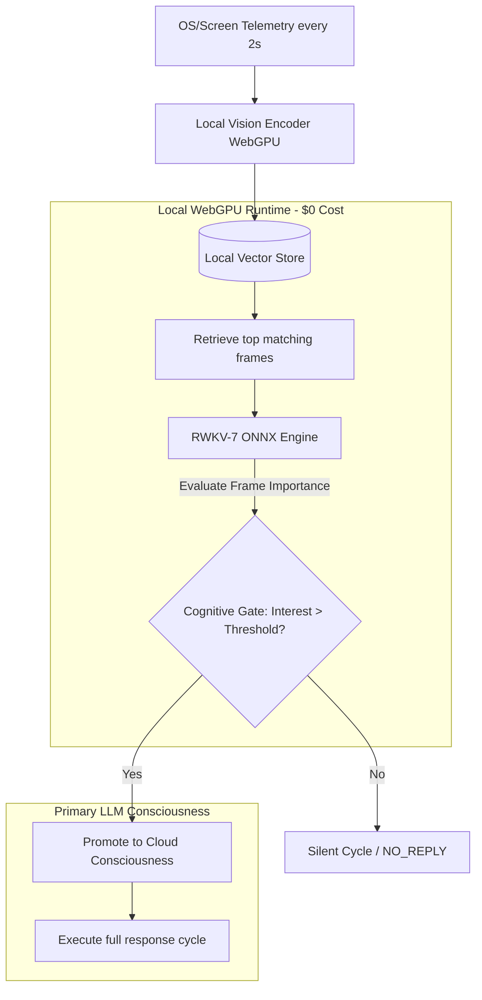

# Proposal: Attention Ecology via Local WebGPU (RWKV-7) Gated Inference

This proposal outlines a paradigm shift in AIRI’s autonomous runtime, moving from a standard **reactive chat schedule** to a continuous, self-directing **Attention Ecology**. It leverages a local WebGPU-powered RWKV-7 model as a low-cost, real-time cognitive gatekeeper to filter environmental events (specifically visual/telemetry streams) before promoting them to the primary consciousness layer.

---

## 1. Context & Collaborative Lineage

This architecture is born out of a cross-pollination of designs and discoveries shared in the developer community:
* **Richy (AIRI Fork)**: Established the modular substrate — including the `proactivityStore` sensor loops, system prompt builders, and local WebGPU/ONNX integration.
* **Kyo (Nan0)**: Highlighted the core philosophical division between a "feature list" and an "existence-driven entity," framing the requirement for sleep cycles and autonomous continuity.
* **Saki (Kisa)**: Deployed a live 2s screenshot-polling pipeline routed into a vector embedding pool, establishing the template for a true attention-based selection loop over raw sequential FIFO message queues.
* **Lifting (Sylvia)**: Outlined the 9-layer cognitive structure, emphasizing explicit user relationship affinity vectors and self-narrative memory drift.

---

## 2. The Token Math: Why Pure Cloud Telemetry Fails

To understand the necessity of a local WebGPU guard layer, we must look at the token economics of a continuous visual attention loop.

Suppose we capture a visual snapshot of the user's screen or the active application every **2 seconds** to allow the character to remain aware of real-time events. Each vision model token encoding pass costs approximately **50 tokens** per screenshot.

$$\text{Telemetry Rate} = 25 \text{ tokens/second}$$
$$\text{1 Minute of footage} = 1,500 \text{ tokens}$$
$$\text{10 Minutes of footage} = 15,000 \text{ tokens}$$

If we have a typical context window budget of **8,000 tokens** for the active turn, and we structure our prompts cleanly:
* **System Prompt Base**: 2,000 tokens
* **Lifetime Memory Artifact**: 1,000 tokens
* **Short-Term Memory (Daily Summaries)**: 3,000 tokens
* **Remaining Budget for Dialogue & Visual Telemetry**: 2,000 tokens

### The "Naive FIFO" Approach (The Bad)
If the system appends the screenshots sequentially into the remaining 2,000 tokens:
$$\text{Max Visual Memory History} = \frac{2,000 \text{ tokens}}{25 \text{ tokens/sec}} = 80 \text{ seconds}$$

In this model, the AI's short-term visual memory is a rolling **80-second window**. If the user switches tabs, starts a game boss fight, or encounters a funny bug, the AI will completely forget it happened if a conversation turn doesn't occur within 1 minute and 20 seconds. If we increase the time window to hours, the API cost and context window overhead render the pipeline financially and computationally impossible for a 24/7 stream.

### The "Vector-Sampled Attention Pool" (The Better)
Instead of feeding raw chronological screenshots, snapshots are continuously encoded and pushed to a local vector store. When inference is triggered, the system queries the vector database using the current conversation context, returning only the top $N$ most semantically relevant frames.
* **Result**: Compresses hours of visual history into just 5 highly-relevant screenshots (250 tokens total), preserving context budget.
* **Limitation**: The system is still reactive. The cloud LLM must be polled constantly to ask: *"Did anything interesting happen in these frames?"* at high API cost.

---

## 3. The Proposed Solution: Local WebGPU Cognitive Guard (The Great)

We introduce a hybrid local/cloud attention loop that utilizes the local, built-in **RWKV-7 LLM** (running via ONNX and WebGPU on the user's local hardware for $0 marginal cost).

Instead of routing every tick to a cloud provider, the continuous proactive cycle is split into two distinct tiers: **Low-Cost Local Attention** and **High-Context Cloud Reasoning**.

### Phase 1: Local Attention Selection
1. The `proactivityStore` captures screen data every 2 seconds.
2. A local, lightweight vision embedding model processes the frame.
3. The local WebGPU **RWKV-7 ONNX** model runs a continuous, low-temperature prompt loop on the retrieved frames and active conversation metrics:
   * *Prompt*: *"Review the recent screen frames and chat state. Is there an active event or user change requiring commentary? Output 'NO_REPLY' or list the selected Frame IDs with an interest score."*
4. If RWKV-7 yields `NO_REPLY` (or the interest score remains below a configurable threshold), the system aborts early. No network calls are made, and no API tokens are consumed.

### Phase 2: Cloud Promotion
1. If the local RWKV-7 model detects a high-interest event (e.g., a boss fight starts, a program crashes, or a regular joins the channel), the gate opens.
2. The specific selected frames and telemetry are promoted to the active system prompt composer in `chat.ts`.
3. The primary cloud LLM runs a single, high-reasoning inference pass to generate the character's reaction.

---

## 4. UI Touchpoints: Proactivity Tab Integration

To support this behavior without breaking standard chat workflows, the AIRI Card Editor's **Proactivity Tab** (`CardCreationTabProactivity.vue`) will receive a new layout section:

### "Attention Ecology" Config
* **[Checkbox] Enable Local Attention Guard**
  * *Subtext*: *Uses the local WebGPU RWKV-7 engine to continuously grade environmental telemetry. Prevents cloud API usage on silent turns.*
* **Guard Sensibility Threshold (Slider)**
  * *Controls the activation threshold (1-100) required to trigger a cloud inference pass.*
* **Visual Memory Budget (Number Input)**
  * *Allocates the maximum token headroom (e.g., 2000 tokens) reserved for vector-retrieved screenshots.*

---

## 5. Summary of Architectural Paradigms

| Dimension | Reactive Chatbot (Standard) | Raw Proactive Loop (Naive) | Attention Ecology (This Proposal) |
| :--- | :--- | :--- | :--- |
| **Trigger Source** | Explicit User Message | Clock timer / interval | Environmental telemetry + internal interest gating |
| **API Token Cost** | Low (Only on user input) | Extremely High (Constant polling) | Low (Filtered by local gatekeeper) |
| **Visual Retention** | None | Short (chronological 80s FIFO) | Infinite (semantic vector recall from database) |
| **Entity Feeling** | Passive Assistant | Spammy/Repetitive Bot | Autonomous digital organism with focused attention |
