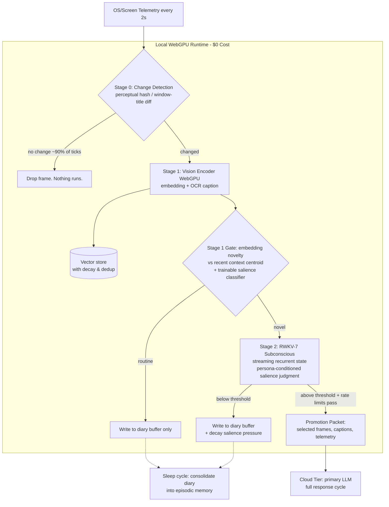

# Proposal: Attention Ecology via Local WebGPU (RWKV-7) Gated Inference

**Status:** Consolidated Draft · **Supersedes:** Legacy `proposal-attention-ecology-local-webgpu-guard.md` specifications

This proposal outlines the design, UI configuration, and backend execution flow for moving AIRI’s autonomous runtime from a reactive chat schedule to a continuous **Attention Ecology**. It leverages a local WebGPU-powered RWKV-7 model as a low-cost, real-time cognitive gatekeeper to filter environmental events (specifically visual/telemetry streams) before promoting them to the primary cloud-based consciousness layer.

---

## 1. Context & Collaborative Lineage

This architecture is born out of a cross-pollination of designs and discoveries shared in the developer community:
* **Richy (AIRI Fork)**: Established the modular substrate — including the `proactivityStore` sensor loops, system prompt builders, local WebGPU/ONNX integration, Vibe Island PoC, and Soul-Controlled animations.
* **Kyo (Nan0)**: Highlighted the core philosophical division between a "feature list" and an "existence-driven entity," framing the requirement for sleep cycles and autonomous continuity. *(Implemented as a scheduled sleep-cycle diary consolidation pass; see §8).*
* **Saki (Kisa)**: Deployed a live 2s screenshot-polling pipeline routed into a vector embedding pool, establishing the template for a true attention-based selection loop over raw sequential FIFO message queues.
* **Lifting (Sylvia)**: Outlined the 9-layer cognitive structure, emphasizing explicit user relationship affinity vectors and self-narrative memory drift.

---

## 2. The Economics: Why Continuous Cloud Perception Fails

To understand the necessity of a local WebGPU guard layer, we must look at the token economics of a continuous visual attention loop.

Let:
*   `f` = capture frequency (frames/sec) — baseline **0.5** (one frame per 2s).
*   `t` = vision tokens per frame for the cloud model — realistically **300–1,500** for a full-resolution screenshot depending on provider tiling; assume **750** as a midpoint.
*   `B` = context budget available for perception after system prompt, identity, and memory — assume **2,000–8,000** tokens.

### The "Naive FIFO" Approach (The Bad)
If the system appends the screenshots sequentially into the remaining context budget:
$$\text{Max Visual Memory History} = \frac{B}{f \cdot t}$$
With the midpoint assumptions, this gives **as little as ~5–20 seconds** of visual memory history. Furthermore, a 24/7 stream costs $f \cdot t \cdot 86,400 \approx 32\text{M}$ vision tokens/day *before any reasoning tokens*. This renders the pipeline financially and computationally impossible for a 24/7 stream.

### The "Vector-Sampled Attention Pool" (The Better)
Instead of feeding raw chronological screenshots, snapshots are continuously encoded and pushed to a local vector store. When inference is triggered, the system queries the vector database using the current conversation context, returning only the top $N$ most semantically relevant frames.
*   **Result**: Compresses hours of visual history into just 5 highly-relevant screenshots (1,250 tokens total), preserving context budget.
*   **Limitation**: The system is still reactive. The cloud LLM must be polled constantly to ask: *"Did anything interesting happen in these frames?"* at high API cost.

---

## 3. Bridging the Modality Gap

Because RWKV-7 is a text-only recurrent architecture, it cannot natively process raw visual pixels. To close this modality gap without sending raw images to a cloud API on every tick, we implement a decoupled visual extraction pipeline:

1.  **Lightweight Local Feature Extractor**:
    *   A local, fast vision-encoder model (such as a browser-native WebGPU WebNN implementation of CLIP or MobileNet) converts the screenshot into a low-dimensional feature vector (embedding).
2.  **Textual Feature Mapping (The Forwarder)**:
    *   To translate these visual vectors into semantic context that RWKV-7 can read, we route high-novelty frames through a local, ultra-fast VLM (e.g. `Moondream2` or a browser-native `SmolVLM` instance) or local tags generator (WD14 Tagger / local Tesseract OCR).
    *   This generates a compact, structured text summary:
        ```text
        [Visual Event]
        Active Window: VS Code (dark mode)
        Screen Content Tags: code editor, rust file, compile error warning
        OCR Text Snippet: "error[E0308]: mismatched types"
        ```

---

## 4. Proposed Solution: The Cascaded Salience Gate

To maximize CPU/GPU efficiency and prevent local hardware from freezing during gameplay, we implement a **Cascaded Gating** pipeline. Instead of running a WebGPU model check every 2 seconds, we deploy a multi-stage wake-up structure where each stage only triggers the next if a change threshold is crossed.



### Stage 0 — Change Detection (µs cost, rejects ~90% of ticks)
*   **Perceptual Hash / Pixel Delta**: Compare the screen capture to the previous tick. A static screen generates no work downstream.
*   **OS Event Hooks**: Window focus switches, process launches, notifications, or audio device changes. On platforms where screen capture is restricted (Wayland, un-granted macOS permissions), OS events become the *primary* telemetry source rather than a supplement.

### Stage 1 — Embedding, Captioning & Trainable Salience Classifier (ms cost)
*   A local vision encoder (CLIP-class) embeds the frame, and a fast OCR/caption generator produces a text description.
*   **Novelty Scoring**: Calculates the cosine distance from the rolling centroid of the last 10 minutes of embeddings.
*   **Trainable Salience Classifier**: A small logistic/MLP head trained on user feedback (dismissed reactions = negative labels; engaged chat turns = positive labels). **The user-facing sensitivity slider maps to this classifier's threshold**, enabling personalized, self-calibrating event selection.

### Stage 2 — The RWKV-7 Subconscious (10s–100s of ms cost)
*   **Streaming Recurrent State**: Captions and event text are streamed continuously into RWKV-7's linear RNN hidden state buffer, accumulating a rolling subconscious awareness for free.
*   **Persona Priming**: The state is primed with the character's Identity DNA and Vibe State, baking persona into how the subconscious perceives.
*   **Constrained-Decoding Judgment**: RWKV-7 runs a constrained decoding pass (masking logits to force a strict output grammar: `PROMOTE <frame-ids> <salience-bucket>` | `NOTE` | `IGNORE`). This prevents small models from emitting invalid strings or arbitrary, uncalibrated scores.
*   **Subconscious Persistence**: The hidden state vector is checkpointed to disk periodically, allowing the subconscious to survive restarts.

---

## 5. Promotion Discipline: Cooldowns & Interruption Etiquette

A correct detector can still produce an annoying, spammy character. Promotion is governed by strict rate-limiting:
*   **Attention Budget**: Maximum $N$ unsolicited promotions per hour (user-configurable).
*   **Hysteresis Cooldown**: After a promotion, the salience threshold spikes and slowly decays over minutes, preventing rapid-fire comments.
*   **Vibe Damping**: Vibe states may modulate the threshold, but the modulation is low-pass filtered and bounded to prevent feedback loops.
*   **Raise-Hand Mode**: Instead of speaking, the character can light up a subtle status dot in the UI, letting the user "pull" the comment when they are ready.

---

## 6. Privacy, Security & Prompt Injection Defenses

Continuous screen capture introduces severe security risks that are mitigated through a multi-layered security gate:

*   **App-Level Exclusion Lists**: Applications like password managers, banking apps, and specific messaging clients are blocklisted. When these windows are active, Stage 0 returns blank frames immediately.
*   **Local-Only Processing**: Raw screenshots are processed strictly in volatile memory (base64 buffers) and are garbage-collected immediately. No image files are ever written to the local disk.
*   **Captions-Only Promotion (Default)**: To prevent exfiltration of sensitive pixels, the cloud LLM only receives text descriptions. Screen image uploads are strictly opt-in and require manual user confirmation.
*   **Prompt Injection Sanitizer**: OCR screen text is untrusted input. To prevent text on the screen from hijacking the AI, OCR results are wrapped in strict `<raw_user_screen_text>` tags, and the primary LLM is instructed to treat all tag contents as untrusted data.

---

## 7. Resource Management: Local Is Not Free

Local WebGPU models consume GPU cycles, VRAM, and thermals on the user's active machine.
*   **Adaptive Duty Cycle**: Capture frequency drops automatically on battery power, high GPU load, or thermal pressure. Stage 0 remains active; Stage 1 and 2 batch and defer.
*   **VRAM Budget**: The WebGPU runtime allocates a static memory cap (maximum 1.2GB VRAM) for the local RWKV-7 model weights, preventing paging conflicts. The optional local VLM is automatically unloaded under memory pressure, falling back to basic OCR.
*   **Latency Budget**: If Stage 2 backlogs, events queue as text into the RWKV stream (cheap) while salience judgments are skipped (fail-quiet).

---

## 8. Memory: Diary, Bounded Storage, and Sleep

*   **Diary Buffer**: Every Stage-1 event is logged to a local text file (timestamp, app, caption, salience) regardless of promotion.
*   **Bounded Storage**: The vector store dedupes near-identical embeddings and applies time-decay to retrieval scores, ensuring bounded storage with graceful forgetting.
*   **Sleep-Cycle Consolidation**: During idle periods/sleep cycles, a local or cloud pass compresses the diary buffer into episodic summaries ("spent the evening debugging code; frustrated, then triumphant at 23:40"). These summaries feed the lifetime memory artifact and are used to re-prime the RWKV subconscious state, giving the character continuity.

---

## 9. The Vibe Island Proof-of-Concept (MVP Sub-system)

To validate the cascaded RNN state-accumulation logic before deploying the full multi-model pipeline, we establish a lightweight, barebones Proof-of-Concept (PoC).

### A. The Input Ticker
*   **Phase 1: Binary Action Loop (MVP)**:
    *   Every 5s, evaluate user input. Feed a single token: **`ACT`** (if mouse/keyboard inputs are detected) or **`IDLE`** (if untouched).
*   **Phase 2: Category Regex Router**:
    *   The user configures simple regex patterns in the settings UI to map active window titles to a dominant category token (`CODE`, `CHAT`, `PLAY`, `BROWSE`, `IDLE`). If multiple actions occur, the dominant active token is fed.

### B. The 3 Subconscious Outputs
1.  **Vibe & Focus Classification**: Polled every 60s using a lightweight prompt. Returns a state keyword (`FOCUSED`, `RESTLESS`, `DRIFTING`, `COMPANIONABLE`) to toggle interface indicators and Live2D idle animations.
2.  **Context-Prompt Modifiers**: Appends a compact vibe tag block (e.g. `[VIBE: FOCUSED/CODING]`) to system prompts when a user message is sent to modulate response tone.
3.  **Internal Soliloquy**: Triggers a short, silent internal thought (e.g., `(He's been coding for a while, looks like he's taking a break...)`) written to a hidden log, which is read by the cloud LLM later to provide natural background continuity.

---

## 10. Soul-Controlled Animations & Interaction Feedback

To make the character's physical presence on screen reflect their inner state, we link the subconscious outputs directly to the 3D model's idle animation cycle.

### A. Constrained Animation Output
Instead of generating generic mood categories, the 60s polling classifier runs a constrained generation pass forced to choose from the character's supported idle animations array (e.g. `idleLoop`, `energetic`, `shy`, `confidentPose`, `cool`, `kawaiiKaiwai`). The local WebGPU runner applies logit biases to restrict predictions to the active animation enums.

### B. The Interaction Feedback Loop (Reward Injection)
1.  Whenever the user sends a message, the system injects a special **`[REWARD: INTERACTION]`** token into the recurrent state.
2.  If the model switches to a specific animation (e.g. `cool`) and the user immediately sends a message, the interaction acts as a **positive reinforcement** signal on that recurrent state path.
3.  If the model switches to an animation (e.g. `crabDance`) and the user does not interact for a long duration, the state decays naturally without reinforcement, indicating low engagement for that transition.

---

## 11. Failure Modes & Fallbacks

| Condition | Behavior |
| :--- | :--- |
| No WebGPU / unsupported GPU | Heuristics-only mode: Stage 0 + OS events + keyword rules gate promotion; no local models. |
| Screen capture permission denied / Wayland | OS-event-only telemetry; character is aware of app switches and window titles, not pixels. |
| Model download declined | Same heuristics-only mode; UI explains the difference. |
| Stage 2 latency exceeds tick | Events stream into RWKV state; judgments skipped until caught up (fail-quiet). |
| Cloud unreachable | Promotions queue in the diary as "wanted to say something about X"; surfaced on reconnect if still relevant (re-scored against decay). |

---

## 12. Evaluation Plan

*   **Labeled Event Set**: Replayable capture sessions annotated for "should the character have reacted?" — target **precision $\ge$ 0.7** at launch (false interruptions are worse than misses).
*   **Cost Telemetry**: Promotions/hour and cloud tokens/day vs. naive baseline; Stage-0 rejection rate (target $\ge$ 85%).
*   **Resource Telemetry**: p95 cascade latency, GPU utilization delta, battery impact.
*   **Behavioral Feedback Loop**: User dismissals/engagements flow back as labels into the Stage-1 classifier, making sensitivity personal.

---

## 13. UI Settings: Proactivity Tab

`CardCreationTabProactivity.vue` gains:
*   **[Toggle] Local Attention Guard**: Enables WebGPU RWKV-7 salience check.
*   **[Slider] Sensitivity**: Maps to the trained Stage-1 classifier threshold.
*   **[Number] Attention Budget**: Maximum unsolicited reactions per hour.
*   **[Select] Promotion Privacy**: Options: captions-only / ask-before-sending-frames / automatic.
*   **[List] Private Apps & Sites**: Stage-0 exclusion list.
*   **[Toggle] Raise-Hand Mode**: Signal instead of speak.
*   **[Toggle] Soul-Controlled Mode**: Mappings for the logit-biased animation enums.
*   **[Regex Table] Category Regex Router**: Connect process/title patterns to `CODE`/`CHAT`/`PLAY`/`BROWSE`/`IDLE` tokens.

---

## 14. Implementation Phasing

1.  **M1 — Cheap Wins**: Stage 0 (perceptual hash + OS events), diary buffer, exclusion lists, heuristic promotion rules, Category Regex Router.
2.  **M2 — Embedding Tier**: Local vision encoder, vector store with dedup/decay, novelty gate, OCR captioning, captions-only promotion.
3.  **M3 — Subconscious & Vibe Island**: RWKV-7 streaming state, constrained-decoding judgments, logit-biased animation enums, reward token injection, Control Island indicators.
4.  **M4 — Learning & Sleep**: Feedback-trained salience classifier, sleep-cycle consolidation, sensitivity preview.

---

## 15. Honest Comparison of Paradigms

| Dimension | Reactive Chatbot | Naive Proactive Loop | Attention Ecology (v2 + Vibe Island) |
| :--- | :--- | :--- | :--- |
| **Trigger** | User message | Clock tick | Cascaded salience: change → novelty → persona-conditioned judgment |
| **Cloud Cost** | Low | Prohibitive (~10⁷ vision tokens/day) | Low; bounded by attention budget |
| **Local Cost** | None | None | Managed (adaptive duty cycle, VRAM/latency budgets) |
| **Visual Memory** | None | Seconds of FIFO | Bounded store with decay + episodic consolidation; RWKV state carries ambient gist |
| **Privacy Exposure** | Chat text only | Every frame uploaded | Local-by-default; captions-only promotion; exclusion lists |
| **Calibration** | n/a | n/a | Trainable classifier + user feedback loop; measured precision/recall |
| **Entity Feeling** | Passive assistant | Spammy bot | Continuity: a subconscious that persists, a diary that consolidates, soul-controlled animations |
