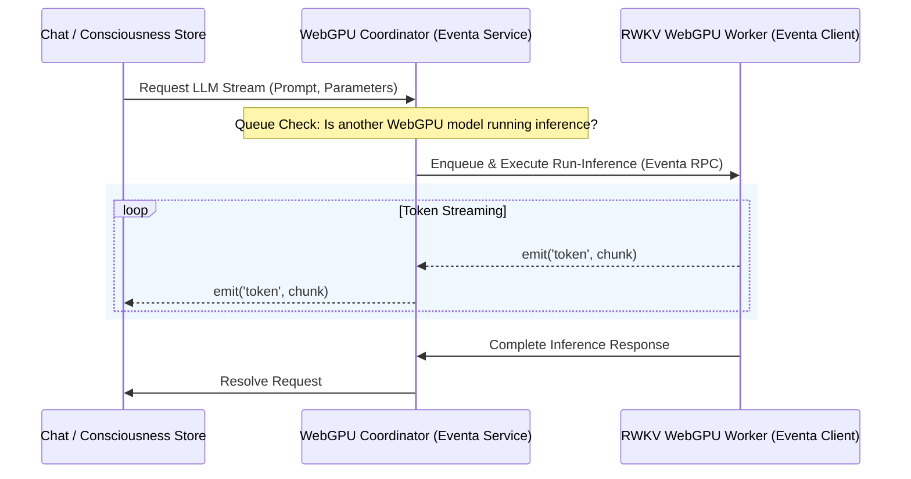

# Proposal: Built-in Local LLM via WebGPU RWKV Provider

## Goal

Add a **built-in, browser-native Local LLM provider** to AIRI using the **RWKV (Receptance-Weighted Key-Value)** architecture running entirely on **WebGPU** (via `web-rwkv` / ONNX).

This integration is paired with a progressive refactor of local providers to use **Eventa** (`@moeru/eventa`) for type-safe, cross-process/runtime-agnostic streaming communication. This achieves two critical architectural objectives:
1. **Unified Streaming Protocol:** Enables all local WebGPU-based model providers (LLM, TTS, STT) to leverage structured, low-overhead streaming.
2. **GPU Load/Inference Queuing:** Implements a strict inference queuing and coordination mechanism to prevent simultaneous WebGPU execution pipelines from running concurrently, which can easily exceed hardware resource limits and crash the GPU driver (Device Loss).

---

## The Vision: 5 Built-in Local ML Models

By integrating RWKV as a first-class local LLM provider, the AIRI local-first distribution grows to feature a comprehensive, fully offline suite of **five built-in ML models**:

1. **Local Whisper** (tiny / base / medium / turbo large) for Speech-to-Text (STT).
2. **Local Kokoro** (82M) for high-quality Text-to-Speech (TTS).
3. **Local MOSS-TTS-Nano** (100M) for zero-shot Multilingual Voice Cloning (coming soon).
4. **Local Qwen** (0.6B) for Semantic Search, vector indexing, and memory retrieval.
5. **Local RWKV** (100M up to 1.5B/3B/7B/13B) as the built-in, attention-free "Consciousness" engine.

---

## What is RWKV and why in-browser/WebGPU?

**RWKV** is a unique hybrid neural network architecture that combines the best properties of both Transformers and Recurrent Neural Networks (RNNs):

- **RNN Inference Efficiency ($O(1)$ Memory & $O(N)$ Time):** Unlike standard Transformer architectures (like LLaMA or Mistral) whose attention mechanism scales quadratically and requires large, growing Key-Value (KV) caches, RWKV uses a linear attention mechanism. Memory usage remains constant during inference regardless of context length, and generation speed is completely stable.
- **Transformer-Parallel Training:** RWKV can be trained in parallel like a traditional Transformer, yielding high-quality, state-of-the-art language capabilities.
- **Ideal for WebGPU:** Due to its attention-free formulation and negligible memory overhead, RWKV is incredibly well-suited to run locally in web browsers or Electron renderers using WebGPU via engines like `web-rwkv` or Web-ONNX. This makes even 100M parameter models highly capable for local orchestration, routing, prompt enrichment, or lightweight conversations, while scaling up to 1.5B/3B/7B or 13B models for powerful reasoning on higher-end local GPUs.

---

## Sebastián's Upstream Fork Context

Sebastián is working on an upstream implementation to introduce a WebGPU-native local RWKV provider.
- **Fork Repository:** [sebastian-zm/airi](https://github.com/sebastian-zm/airi)
- **Primary Strategy:**
  - Introduce `rwkv` as a new local model provider card under **Settings > Providers > Consciousness**.
  - Refactor existing local model providers to communicate over **Eventa** to enable seamless, low-overhead, unified streaming.
  - Implement a central GPU executor/inference queue to prevent overlapping VRAM-intensive kernels from causing GPU context crashes.

---

## Architectural Refactor: Eventa-based Unified WebGPU Streaming & Queuing

To safely bolt a built-in WebGPU LLM onto AIRI's local model suite, we must address the fundamental hardware limitation: **WebGPU is single-threaded per context and highly sensitive to concurrent execution spikes.**

### 1. The Queue & Coordination Layer
Without execution queuing, running a speech-to-text inference (Whisper) *while* generating a token stream (RWKV) *while* generating synthesized audio (Kokoro) will cause simultaneous WebGPU submissions. This leads to out-of-memory states, execution timeouts, and browser-enforced `GPUDevice` losses.

- **Queued Execution Registry:** Introduce a centralized scheduling queue in `packages/stage-ui/src/libs/inference/coordinator.ts` or as an Eventa service. All local WebGPU providers must register their execution payloads (`run-inference` tasks) through this coordinator.
- **VRAM Bookkeeping:** Build upon the existing `gpu-resource-coordinator.ts` to actively delay or yield execution turns if the estimated VRAM pressure exceeds a predefined threshold.

### 2. Eventa-Based Model Streaming Contract
Currently, local workers use various custom postMessage structures. Refactoring these to use Eventa (`@moeru/eventa`) allows us to establish a type-safe RPC and event streaming protocol that works identically across Electron main/renderer processes and standard web workers.



---

## Integration Plan: Consciousness Provider Settings & Wiring

We will expose RWKV under the existing provider model framework in AIRI:

### 1. Provider Registration (`packages/stage-ui/src/stores/providers.ts`)
We will register `rwkv-local` under the `consciousness` category:

```typescript
// Proposed registration in providers.ts
{
  id: 'rwkv-local',
  category: 'consciousness',
  tasks: ['chat', 'text-generation'],
  deployment: 'local',
  capabilities: {
    listModels: (config) => [
      { id: 'rwkv-100m', name: 'RWKV 100M (Ultra-lightweight)', size: '100M', platform: 'webgpu' },
      { id: 'rwkv-1.5b', name: 'RWKV 1.5B (Recommended)', size: '1.5B', platform: 'webgpu' },
      { id: 'rwkv-3b', name: 'RWKV 3B (High Performance)', size: '3B', platform: 'webgpu' },
    ],
    loadModel: async (config, hooks) => {
      // Serialized load via coordinator
      await getLoadQueue().enqueue(async () => {
        const worker = getRWKVWorker();
        await worker.loadModel(config.model, { onProgress: hooks?.onProgress });
      });
    }
  }
}
```

### 2. User Settings Layout
The user interface under `packages/stage-pages/src/pages/settings/providers/consciousness/` will render a dedicated card for RWKV where the user can:
- Toggle between **WebGPU** and **WASM/CPU fallback** execution.
- Select the parameter size (e.g., 100M, 1.5B, 3B).
- Configure sampling parameters (Temperature, Top-P, Presence/Frequency Penalty).

---

## Key Technical Questions & Implementation Checkpoints

### 1. Weights Acquisition & Caching
- **Where are weights fetched from?** Hugging Face (e.g., the official `BlinkDL` or community WebGPU-optimized quantized weights repositories).
- **Caching Mechanism:** Standard Web Cache Storage API (for browser compatibility) and Electron local cache path (for desktop packaging).
- **Download Telemetry:** High-fidelity loading states must be plumbed to ensure a smooth onboarding experience since weights range from 200MB (100M model quantized) to multiple gigabytes.

### 2. Eventa Integration inside Web Workers
- Verify `@moeru/eventa` integration constraints inside Web Workers or Service Workers.
- Ensure event serialization overhead does not bottleneck token generation throughput.

### 3. VRAM De-allocation (LRU Model Unloading)
- Since LLMs have high VRAM footprints compared to Whisper/Kokoro, an automatic **LRU (Least Recently Used) Unload** policy is paramount. If a user triggers a speech synthesis (TTS) request and the GPU is out of VRAM, the coordinator must automatically command the RWKV provider to temporarily unload or offload its sessions.

---

## Summary of Next Steps

1. **Monitor & Track:** Keep a close watch on [sebastian-zm/airi](https://github.com/sebastian-zm/airi)'s repository changes.
2. **Refactor Eventa Contracts:** Draft unified message definitions for local model providers.
3. **Draft the Local Queue Coordinator:** Initialize the queuing service to intercept execution pipelines.
4. **Port the RWKV Provider:** Cherry-pick/merge Sebastián's WebGPU RWKV worker and adapter implementation into this repository once stable, then expose it in the settings.

---

## Post-Implementation Notes (June 2026)

This section documents real-world findings, bugs fixed, and known gaps discovered after the initial RWKV WebGPU provider shipped.

---

### What Was Actually Shipped

The implementation diverged from several proposal details. Key actuals:

- **Worker**: `packages/stage-ui/src/workers/web-rwkv/worker.ts` — a self-contained Web Worker that speaks the Eventa inference contract (`webRwkvLoadEvent`, `webRwkvGenerateEvent`, `webRwkvUnloadEvent`).
- **OPFS Cache**: `packages/stage-ui/src/workers/web-rwkv/cache.ts` — fully custom, writes/reads converted f16 tensors to the Origin Private File System. The cache key is the SHA-256 of the model URL. On a cache hit the download is skipped entirely.
- **Caching Format**: On-disk layout is `[tensor data][index JSON][8-byte footer (index length as LE u64)]`. A partial/corrupt write is detected by footer + size validation and triggers a clean re-download.
- **OPFS Storage Widget**: The model file (like all other ML models) appears in the OPFS storage widget at the bottom of **Settings → Providers**, where users can inspect size and delete it.
- **HuggingFace Token**: The worker reads `localStorage.getItem('settings/connection/hf-token')` at load time, which is set via the HF Token field under **Settings → System → Connection**. This same token is already used by Kokoro and Whisper workers.
- **Concurrency**: Range requests are fetched 8 at a time (`TENSOR_FETCH_CONCURRENCY = 8`), coalesced into chunks up to 128 MiB (`MAX_CHUNK_BYTES`) to minimize round-trips against HF's CDN while staying within HTTP/2 multiplexing limits.
- **Default model**: `DanielClough/rwkv7-g1-safetensors` — specifically the 0.1B variant (`rwkv7-g1d-0.1b-20260129-ctx8192.safetensors`). This is the smallest viable model for WebGPU; larger weights (1.5B, 3B) can be wired in but require more VRAM.

---

### Bugs Fixed

#### 1. Model kept re-downloading (original Sebastián implementation)
The original implementation did not use OPFS. Every activation triggered a fresh download from HuggingFace, which caused HF to throttle/ban the IP after a few runs. Fixed by implementing proper OPFS caching (see `cache.ts`).

#### 2. HuggingFace rate-limit HTML page cached by browser (`cache: 'no-cache'` bug)
After getting rate-limited, the browser HTTP cache stored the HTML error response. Subsequent attempts returned the cached HTML page even though the user had since added a valid HF token. The error manifested as:

```
web-rwkv: invalid safetensors header length (8104636974849335000 bytes).
Preview of first 8 bytes: "<!doctyp"
```

The fix was changing every `fetch()` call in the worker from `cache: 'no-cache'` to `cache: 'no-store'`.

- **`cache: 'no-cache'`** — revalidates with server but still *uses* the cached response if server says it's fresh. A cached HTML block page would survive this.
- **`cache: 'no-store'`** — completely bypasses the browser HTTP cache on every request. Correct since OPFS is the real caching layer.

Both the initial probe (`bytes=0-7`) and all subsequent range fetches now use `cache: 'no-store'`.

#### 3. Stale OPFS cache after corruption
If the OPFS cache file is partial (e.g. interrupted download), the reader detects the mismatch between the footer-declared index size and actual file size, logs a warning, deletes the file, and falls back to a fresh download. The user does not need to manually clear anything.

---

### Diagnostic Logging Added

The worker now emits structured console logs that surface in both the browser DevTools console and the Electron terminal. These persist indefinitely as an early-warning system:

| Prefix | When |
|---|---|
| `[web-rwkv:probe]` | Initial `bytes=0-7` probe — logs URL, auth presence, HTTP status, Content-Type, resolved CDN URL, and raw hex of the first 8 bytes |
| `[web-rwkv:fetch]` | Every range request — logs byte range, status, Content-Type |
| `[web-rwkv:worker]` | General lifecycle events (wasm init, cache hit/miss, progress, session built) |
| `[web-rwkv:cache]` | OPFS cache read/write events, finalization, errors |

If HF ever returns an HTML error page instead of binary again, the logs will show `content-type: text/html` and dump the first 200–300 chars of the HTML body before throwing a clear user-facing error message.

---

### HuggingFace Token — Why It Matters

HuggingFace applies unauthenticated rate limits at the IP level (roughly 300 requests per 5-minute window per the `RateLimit-Policy: q=3000;w=300` header). A model download issues **hundreds** of range requests (one per tensor coalesced chunk), so it is very easy to exhaust the anonymous quota in a single load — especially if the OPFS cache is cold.

With a valid HF token (set under **Settings → System → Connection → Hugging Face Token**):
- Rate limits are much higher (or eliminated for most public models)
- The `Authorization: Bearer <token>` header is injected into every fetch call
- The same token is shared with Kokoro and Whisper workers

Without a token, a single model download can exhaust your anonymous quota and cause subsequent Whisper/Kokoro downloads to fail too, since they share the same IP.

---

### RWKV Fine-tune Ecosystem — Gaps & Reality (as of June 2026)

During research into adding a curated model list to the provider UI, the following landscape was mapped:

#### Available models compatible with the current loader (safetensors, direct URL)

| Model | Size | English? | Notes |
|---|---|---|---|
| [DanielClough/rwkv7-g1-safetensors](https://huggingface.co/DanielClough/rwkv7-g1-safetensors) | 0.1B | ✅ Full | **Currently shipping default.** General-purpose reasoning base, not roleplay-tuned. |
| BlinkDL/rwkv7-g1 (various) | 1.5B, 3B, 7B | ✅ Full | Official base models. Released as `.pth`, not `.safetensors` — would need conversion or a community mirror. |
| [Seikaijyu/rwkv7-g1-1.5b-Lonely-Neko](https://huggingface.co/Seikaijyu/rwkv7-g1-1.5b-Lonely-Neko) | 1.5B | 🇨🇳 Chinese only | Tagged `language: zh`. Deeply specialized single-character RP fine-tune. Not suitable for English users. |
| [Seikaijyu collection (SingleRole Models)](https://huggingface.co/Seikaijyu) | 1.5B | 🇨🇳 Chinese only | All models in this collection are Chinese-exclusive RP fine-tunes. |

#### Bilingual (Chinese + English) — but not directly loadable

| Model | Size | English? | Notes |
|---|---|---|---|
| [shoumenchougou/RWKV-7-G1-RolePlay-State](https://huggingface.co/shoumenchougou/RWKV-7-G1-RolePlay-State) | N/A (State file) | ✅ Bilingual | Explicitly says "支持中英双语." Updated with English data in Jan 2026. **Critical limitation:** This is a *State file*, not standalone weights. It must be merged with a base model via `state-merge` script before use. Our loader cannot load it directly. |

#### Key gaps

1. **No English-first roleplay fine-tune exists in safetensors format** as of June 2026. The entire RWKV7-G1 fine-tuning community is predominantly Chinese.
2. **State files are unsupported** by the current loader. Supporting them would require either (a) a pre-merge step server-side, or (b) teaching the loader to overlay a state file on a base model at runtime.
3. **The 0.1B default model produces flat, non-expressive responses** for roleplay. It was designed as a reasoning/Q&A model. A 1.5B or larger fine-tuned model would be significantly better, but no English RP fine-tunes exist at that size yet.
4. **Community-curated model dropdowns** — the ideal UX — cannot be populated with high-quality English roleplay options until the community catches up.

---

### Future Directions

#### Short-term
- [ ] **Watch [Seikaijyu's instruct preview](https://huggingface.co/Seikaijyu/rwkv7-g1-1.5b-instruct-preview)** (dropped July 2026) — if it includes English instruction following, it could be a meaningful upgrade from the 0.1B base.
- [ ] **Add a curated model dropdown** in the web-rwkv provider settings. Even with only the base 0.1B and 1.5B (once a `.safetensors` mirror exists), giving users a size choice is valuable.
- [ ] **Support for larger base models** (1.5B, 3B) — the architecture handles them fine; the bottleneck is user VRAM and finding a `.safetensors`-format mirror of the official `.pth` weights.

#### Medium-term
- [ ] **State file support** — allow loading a base model URL + a separate state file URL. Merge them in the worker before creating the session. This would unlock the shoumenchougou roleplay state and any future English state fine-tunes.
- [ ] **Prompt template awareness** — different fine-tunes use different system prompt formats (e.g., the shoumenchougou model expects `You are [role], [description]`). The provider should expose a prompt template field alongside the model URL.
- [ ] **Custom model URL input** — let power users paste any HF safetensors URL directly, bypassing the curated list.

#### Long-term
- [ ] Once English roleplay fine-tunes mature (likely mid-to-late 2026), the curated list becomes genuinely useful. Track: RWKV community Discord, the `shoumenchougou` and `Seikaijyu` HF profiles, and the official RWKV blog.
- [ ] **VRAM-aware model switching** — if the user's GPU can't fit a 1.5B model, auto-suggest the 0.1B. The current VRAM estimator in `gpu-resource-coordinator.ts` has the scaffolding for this.

---

### Sampling Parameter Design — Why Some Params Are Read-Only & Why the Generation Tab Is Missing 3 of Them

This is one of the less obvious design decisions in the web-rwkv integration. An agent picking up this codebase needs to understand it before touching anything related to generation quality or the settings UI.

---

#### Background: RWKV's Sampler Has 5 Parameters, OpenAI Has 2

The `NucleusSampler` inside `web-rwkv-wasm` accepts five independent parameters per generation call (as defined in [`WebRwkvGenerateRequest`](../packages/stage-ui/src/libs/inference/contract.ts)):

| Parameter | What it does | Maps to OpenAI? |
|---|---|---|
| `temperature` | Sharpness of the token probability distribution | ✅ `temperature` |
| `topP` | Nucleus sampling cutoff | ✅ `top_p` |
| `presencePenalty` | One-time penalty per token that has appeared at all | ⚠️ `presence_penalty` (partial) |
| `countPenalty` | Additional penalty scaled by *how many times* a token appeared | ❌ No equivalent |
| `penaltyDecay` | Exponential decay applied to penalty history each step | ❌ No equivalent |

The last three together form RWKV's anti-repetition system. They are fundamentally different from OpenAI's `presence_penalty` and `frequency_penalty` (OpenAI's are one-shot; RWKV's decay over time and have separate count vs. presence axes).

---

#### The Provider Page: Why `countPenalty` and `penaltyDecay` Are Read-Only

The web-rwkv provider sits behind an **OpenAI-compatible chat completions endpoint** (`POST /chat/completions`). The provider shim in [`stores/providers/web-rwkv/index.ts`](../packages/stage-ui/src/stores/providers/web-rwkv/index.ts) maps the incoming JSON body to a `WebRwkvGenerateRequest`. The mapping is:

```
body.temperature       → request.temperature        (passthrough)
body.top_p             → request.topP               (passthrough)
body.presence_penalty  → request.presencePenalty     (passthrough, OpenAI-compatible field used as a proxy)
(hardcoded)            → request.countPenalty        = DEFAULT_COUNT_PENALTY  (0.4)
(hardcoded)            → request.penaltyDecay        = DEFAULT_PENALTY_DECAY  (0.996)
```

`countPenalty` and `penaltyDecay` are **hardcoded constants** because there is no standard OpenAI field they can be threaded through. The OpenAI chat completions spec has no `count_penalty` or `penalty_decay` field — inventing new fields would break xsai/OpenAI-SDK compatibility, and would require every caller (the chat store, the character card, the LLM store) to know they're talking to an RWKV model specifically.

**This is why they appear as read-only display values on the provider settings page** — they're informational. They tell the user what the defaults are, signal that these knobs exist (which matters for power users who know RWKV), but make it unambiguous that you can't change them through the standard generation flow. Showing them as editable would imply they're wired end-to-end, which they're not.

The `presencePenalty` field *can* technically be passed from the character card via `body.presence_penalty`, but since the character card's generation tab doesn't expose it (see below), it defaults to `0.4` via the constant.

---

#### The Generation Tab: Why It Only Shows 3 Parameters, Not 5

The character card's **Generation** tab (accessible by editing a character) exposes this schema (from [`stores/modules/airi-card.ts`](../packages/stage-ui/src/stores/modules/airi-card.ts)):

```typescript
interface CharacterGenerationConfig {
  known?: {
    maxTokens?: number // → max_tokens
    temperature?: number // → temperature
    topP?: number // → top_p
    contextWidth?: number // context window management
    reasoningFallback?: boolean
  }
  advanced?: Record<string, any> // raw override passthrough
}
```

These `known` fields are **the OpenAI-compatible universal subset** — the parameters that work identically whether the active provider is OpenAI, Anthropic, Mistral, Ollama, or web-rwkv. They're wired directly into every `llmStore.stream()` call (in [`stores/chat.ts`](../packages/stage-ui/src/stores/chat.ts#L901)):

```typescript
await llmStore.stream(model, provider, messages, {
  temperature: generationKnown?.temperature,
  top_p: generationKnown?.topP,
  max_tokens: generationKnown?.maxTokens,
  ...
})
```

**The three RWKV-specific params (`presencePenalty`, `countPenalty`, `penaltyDecay`) are absent from the generation tab because:**

1. **Provider-agnostic design.** The generation tab is intentionally provider-neutral. A character should be portable — you should be able to swap the active provider from web-rwkv to OpenAI without the character's generation settings becoming invalid or meaningless. RWKV-specific fields would only confuse users on non-RWKV providers.

2. **No cross-provider mapping.** There is no safe way to map `countPenalty` or `penaltyDecay` to an OpenAI equivalent. Showing them as editable in the character card implies the provider will honor them — but they'd be silently ignored on every non-RWKV provider.

3. **The `advanced` escape hatch exists for this.** The character card has an `advanced: Record<string, any>` field that is passed directly as `requestOverrides` to the provider's fetch layer. Power users who know they're always on web-rwkv can in theory put RWKV-specific fields there, though there is currently no UI for it — it's JSON-only.

---

#### The Copy-Paste Block on the Provider Page

The provider settings page for web-rwkv shows a read-only code block (or equivalent display) with the three hardcoded defaults:

```
presencePenalty  0.4
countPenalty     0.4
penaltyDecay     0.996
```

**The purpose of this block is:**
- Show the user the actual values being used (transparency)
- Explain *why* they can't be changed here (wrong layer — character-level tuning is the right place)
- Give the model's recommended values for reference if someone wants to fine-tune via the `advanced` field

These defaults were chosen to match the values used by the upstream `web-rwkv-wasm` example and the shoumenchougou roleplay model's recommended parameters. They produce stable, non-repetitive output for the 0.1B base model at the default temperature of 1.0.

---

#### Design Intent: Per-Character Tuning, No Global Settings

The app has a deliberate philosophy: **generation parameters belong to the character, not the provider and not the app globally.**

- Different characters warrant different generation styles. A terse, dry-humored character needs lower temperature and higher penalties. A dramatic, verbose character needs higher temperature and softer penalties. Enforcing global settings defeats this.
- The provider is an infrastructure concern (which LLM backend to hit). The character is the experience concern (how that LLM should behave for this persona). These are orthogonal axes and are intentionally separated.
- The `known` fields on the character card are the correct knobs for `temperature` and `top_p`. `countPenalty` / `penaltyDecay` are not in `known` today — if RWKV becomes the primary/only provider for a significant subset of users, those fields should be added to `known` (gated by an `if (provider === 'web-rwkv')` display condition in the UI), not exposed globally.

Any future agent adding RWKV-specific generation controls should:
1. Add the fields to `CharacterGenerationConfig.known` (not a new global store)
2. Render them in the Generation tab only when the character's configured provider is `web-rwkv`
3. Thread them through the provider shim via a new non-standard field name (e.g., `x_rwkv_count_penalty`) to keep the OpenAI-compatible path clean
