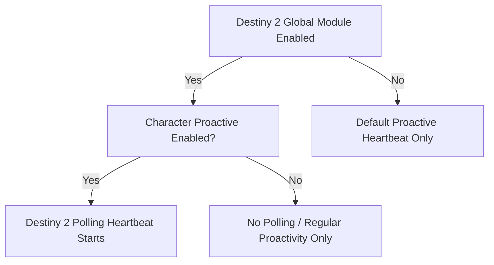
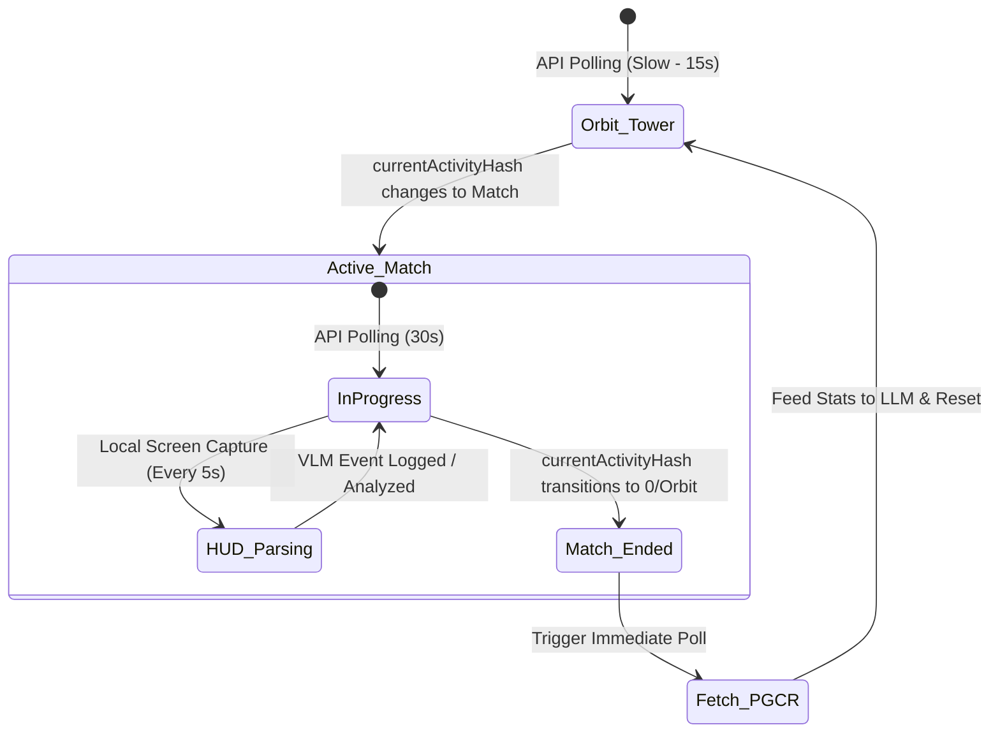

# Proposal: Destiny 2 Game-Driven Proactive Speech Plugin

This proposal outlines the design and integration of a Destiny 2 game-driven plugin for the AIRI client. By leveraging the Bungie API, AIRI can dynamically track live PvP/PvE status and inject real-time game events and post-match performance analyses directly into the character's proactive speech loop.

---

## 1. Architectural & Core Concepts

### Dual-Conditional Activation
To prevent unexpected resource overhead or unsolicited commentary, the Destiny 2 integration is structured as a dual-conditional mechanism:
1. **Global Plugin Activation:** Settings > Modules > Destiny2. Users must toggle the module on and authenticate their account.
2. **Character-Level Activation:** The active character must have proactive speech enabled. The Destiny 2 background polling loop piggybacks on top of the character's existing proactive heartbeat, dynamically adjusting the polling interval based on current game state.



---

## 2. Setting up the Module Settings UI

The plugin adds a new settings view under `Settings > Modules > Destiny2`.

```
Settings > Modules > Destiny2
┌────────────────────────────────────────────────────────┐
│  [X] Enable Destiny 2 Integration                      │
│                                                        │
│  Bungie Name: [ dasilva333               ]             │
│                                                        │
│  [ Search Accounts ]                                   │
│  Results:                                              │
│  (X) dasilva333#5064                                   │
│      -> [PSN] ID: 4611686018465072462 (Active)         │
│      -> [Steam] ID: 4611686018488684637                │
│                                                        │
│  ─── Advanced Controls ─────────────────────────────── │
│  [X] Comment on Post-Game Carnage Reports (PGCR)       │
│  [X] Comment when entering matchmaking / loading maps  │
│  [X] Enable Local WebGPU HUD Tracking (FastVLM)        │
│  [ ] Show encouragement on death streaks               │
└────────────────────────────────────────────────┘
```

### The "Search Accounts" Flow
1. User enters their plain **Bungie Name** (e.g., `dasilva333`) without needing to know their hashtag code.
2. AIRI calls `User.SearchByGlobalNamePost` (endpoint `/User/Search/GlobalName/0/`) to retrieve matched accounts globally.
3. The UI presents the matching user accounts and resolves all underlying platform-specific membership entries (PSN, Steam, Xbox).
4. The user selects the active target account, and the plugin stores the matching `membershipId` and `membershipType` for background checks.

---

## 3. The Polling Lifecycle (Dynamic Timers & Local VLM)

Instead of polling at a constant, static interval, the polling loop behaves like a state machine to reduce rate limits when idle, but transitions to active visual parsing once a match begins.



### State Triggers & API Details

#### 1. Checking Live State
* **API Component:** `GET /Destiny2/{membershipType}/Profile/{destinyMembershipId}/?components=204` (CharacterActivities)
* **Frequency:** 15s in Orbit/Tower, 30s once inside a match.
* **Transition:** When `currentActivityHash` changes from `0` (or orbit activity hash) to a PvP/PvE map hash, trigger the `MATCH_STARTED` event.

#### 2. Local VLM HUD Parsing (In-Match)
Once inside an active match:
* **Model:** `onnx-community/FastVLM-0.5B-ONNX` running locally client-side via WebGPU.
* **Frequency:** Every 5 seconds, capture the player's screenshot.
* **Dynamic Crops:**
  * **Top-Center HUD Crop:** Extracted coordinates `{ left: 700, top: 0, width: 520, height: 180 }` (isolates scores, time, objective).
  * **Bottom-Left HUD Crop:** Extracted coordinates `{ left: 50, top: 800, width: 400, height: 250 }` (isolates super percentage tracker, active weapons).
* **Latency:** ~2.5s on CPU, <300ms via browser WebGPU.

#### 3. Detecting Match End & Fetching PGCR
* **Trigger:** When `currentActivityHash` transitions back to Orbit/Tower (`0`), immediately trigger a one-shot fetch for the Post Game Carnage Report.
* **Endpoint 1:** `GET /Destiny2/{membershipType}/Account/{destinyMembershipId}/Character/{characterId}/Stats/Activities/?count=1` to grab the latest completed match's `instanceId`. (Note: Must use a valid `characterId` from `components=200`, as `0` is not supported as a wildcard for activity history lists).
* **Endpoint 2:** `GET /Destiny2/Stats/PostGameCarnageReport/{instanceId}/` to download performance details.

---

## 4. Context Payload Sent to AIRI's LLM

When a game-state transition is detected, the event-driven module intercepts the heartbeat, bypasses the standard idle prompt, and formats a rich, situational prompt for the active character.

### Example Event: `MATCH_STARTED`
* **Injected Context:**
  ```yaml
  Game: 'Destiny 2'
  Event: 'MATCH_STARTED'
  ActivityType: 'Trials of Osiris'
  Map: 'The Burnout'
  CurrentLoadout: "Ace of Spades, Matador 64, Tomorrow's Answer"
  ```
* **AIRI's Prompt Context Directive:**
  *"Your companion has just entered a competitive match. Acknowledge the map/mode or express anticipation based on their loadout."*

### Example Event: `IN_MATCH_HUD_UPDATE` (Local VLM Event Triggers)
Rather than forcing commentary on a static interval, in-match dialogue is triggered by key delta-threshold events captured by the local VLM loop:
1. **The Lead Change:** Blue score overtakes Red score (comeback / lead loss commentary).
2. **Time Warnings:** Time remaining reaches `1:00` or `0:30` (final pushes).
3. **Super Availability:** Yellow bar fills up indicating Super is active (tactical recommendation).

* **Injected Context:**
  ```yaml
  Game: 'Destiny 2'
  Event: 'IN_MATCH_HUD_UPDATE'
  DeltaAlert: 'LEAD_CHANGE' # Or "TIME_WARNING_30S", "SUPER_CHARGED"
  Scores:
    BlueTeam: 5 # Previously 3
    RedTeam: 4 # Previously 5
  TimeLeft: '1:21'
  SuperAvailable: true
  ```
* **AIRI's Prompt Context Directive:**
  *"Your companion's team just took the lead in a close game, and their Super is charged. Offer high-energy encouragement and remind them to secure the win."*

### Example Event: `MATCH_COMPLETED` (Normal Match)
* **Injected Context:**
  ```yaml
  Game: 'Destiny 2'
  Event: 'MATCH_COMPLETED'
  ActivityType: 'Crucible Control'
  Map: 'Javelin-4'
  Outcome: 'Victory (150 - 142)'
  Performance:
    Kills: 25
    Deaths: 10
    Assists: 8
    KD: 2.5
    CombatRatingRank: 1 # Top of the leaderboard
    PrimaryWeaponKills: 15 # Ace of Spades
  ```
* **AIRI's Prompt Context Directive:**
  *"Your companion just finished their match. Comment on their performance, victory/defeat, K/D ratio, and any standout accomplishments like topping the leaderboard."*

### Example Event: `MATCH_COMPLETED` (Mercy Rule / Joined in Progress)
* **Injected Context:**
  ```yaml
  Game: 'Destiny 2'
  Event: 'MATCH_COMPLETED'
  ActivityType: 'Crucible Control'
  Map: 'Burnout'
  Outcome: 'Defeat'
  Duration: '6m 46s'
  TerminationReason: 'Mercy Rule'
  Performance:
    TotalTimePlayed: '2m 33s'
    JoinedInProgress: true
    Kills: 0
    Deaths: 1
    Assists: 0
    KD: 0.00
    DefeatedByMercy: true
  ```
* **AIRI's Prompt Context Directive:**
  *"Your companion joined a match in progress just before it got mercied, resulting in a swift defeat. Acknowledge that the circumstances were out of their control and offer playful or tactical comments about the situation."*

---

## 5. Prompt Compilation & Cache Alignment

To guarantee high cache hit rates during active match periods (where the loop evaluates game-state data and captured HUD context), the Destiny 2 plugin prompt assembly must align with the global prefix caching standard:

1. **No Dedicated Caching UI**: The Destiny 2 plugin settings page will not introduce local controls for prefix caching or history depth. This prevents UI clutter and keeps plugin settings focused entirely on gameplay mechanics.
2. **Global Fallbacks**: Prompt generation for the Destiny 2 agent will directly invoke `compileCacheAlignedPrompt` from the unified `useContextBuilder` utility, inheriting the global `useSettingsLlmPerformance` defaults.
3. **Suffix Payload Formatting**: Telemetry data (such as active weapon loadouts, score differentials, team performance, or time notifications) is structured as a schema-aligned suffix and passed via `instructionSuffix` at the absolute tail of the prompt. This keeps the initial system prompt and historical chat message arrays completely static, maximizing cache hits across evaluations.
