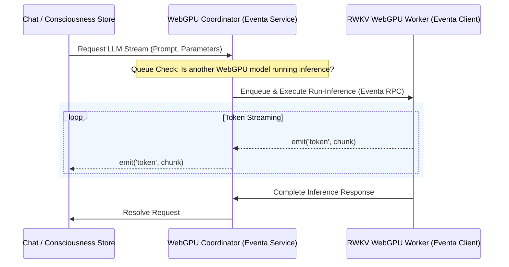

# Proposal: Built-in Local LLM via WebGPU RWKV Provider

## Goal

Add a **built-in, browser-native Local LLM provider** to AIRI using the **RWKV (Receptance-Weighted Key-Value)** architecture running entirely on **WebGPU** (via `web-rwkv` / ONNX).

This integration is paired with a progressive refactor of local providers to use **Eventa** (`@moeru/eventa`) for type-safe, cross-process/runtime-agnostic streaming communication. This achieves two critical architectural objectives:
1. **Unified Streaming Protocol:** Enables all local WebGPU-based model providers (LLM, TTS, STT) to leverage structured, low-overhead streaming.
2. **GPU Load/Inference Queuing:** Implements a strict inference queuing and coordination mechanism to prevent simultaneous WebGPU execution pipelines from running concurrently, which can easily exceed hardware resource limits and crash the GPU driver (Device Loss).

---

## The Vision: 5 Built-in Local ML Models

By integrating RWKV as a first-class local LLM provider, the AIRI local-first distribution grows to feature a comprehensive, fully offline suite of **five built-in ML models**:

1. **Local Whisper** (tiny / base / medium / turbo large) for Speech-to-Text (STT).
2. **Local Kokoro** (82M) for high-quality Text-to-Speech (TTS).
3. **Local MOSS-TTS-Nano** (100M) for zero-shot Multilingual Voice Cloning (coming soon).
4. **Local Qwen** (0.6B) for Semantic Search, vector indexing, and memory retrieval.
5. **Local RWKV** (100M up to 1.5B/3B/7B/13B) as the built-in, attention-free "Consciousness" engine.

---

## What is RWKV and why in-browser/WebGPU?

**RWKV** is a unique hybrid neural network architecture that combines the best properties of both Transformers and Recurrent Neural Networks (RNNs):

- **RNN Inference Efficiency ($O(1)$ Memory & $O(N)$ Time):** Unlike standard Transformer architectures (like LLaMA or Mistral) whose attention mechanism scales quadratically and requires large, growing Key-Value (KV) caches, RWKV uses a linear attention mechanism. Memory usage remains constant during inference regardless of context length, and generation speed is completely stable.
- **Transformer-Parallel Training:** RWKV can be trained in parallel like a traditional Transformer, yielding high-quality, state-of-the-art language capabilities.
- **Ideal for WebGPU:** Due to its attention-free formulation and negligible memory overhead, RWKV is incredibly well-suited to run locally in web browsers or Electron renderers using WebGPU via engines like `web-rwkv` or Web-ONNX. This makes even 100M parameter models highly capable for local orchestration, routing, prompt enrichment, or lightweight conversations, while scaling up to 1.5B/3B/7B or 13B models for powerful reasoning on higher-end local GPUs.

---

## Sebastián's Upstream Fork Context

Sebastián is working on an upstream implementation to introduce a WebGPU-native local RWKV provider.
- **Fork Repository:** [sebastian-zm/airi](https://github.com/sebastian-zm/airi)
- **Primary Strategy:**
  - Introduce `rwkv` as a new local model provider card under **Settings > Providers > Consciousness**.
  - Refactor existing local model providers to communicate over **Eventa** to enable seamless, low-overhead, unified streaming.
  - Implement a central GPU executor/inference queue to prevent overlapping VRAM-intensive kernels from causing GPU context crashes.

---

## Architectural Refactor: Eventa-based Unified WebGPU Streaming & Queuing

To safely bolt a built-in WebGPU LLM onto AIRI's local model suite, we must address the fundamental hardware limitation: **WebGPU is single-threaded per context and highly sensitive to concurrent execution spikes.**

### 1. The Queue & Coordination Layer
Without execution queuing, running a speech-to-text inference (Whisper) *while* generating a token stream (RWKV) *while* generating synthesized audio (Kokoro) will cause simultaneous WebGPU submissions. This leads to out-of-memory states, execution timeouts, and browser-enforced `GPUDevice` losses.

- **Queued Execution Registry:** Introduce a centralized scheduling queue in `packages/stage-ui/src/libs/inference/coordinator.ts` or as an Eventa service. All local WebGPU providers must register their execution payloads (`run-inference` tasks) through this coordinator.
- **VRAM Bookkeeping:** Build upon the existing `gpu-resource-coordinator.ts` to actively delay or yield execution turns if the estimated VRAM pressure exceeds a predefined threshold.

### 2. Eventa-Based Model Streaming Contract
Currently, local workers use various custom postMessage structures. Refactoring these to use Eventa (`@moeru/eventa`) allows us to establish a type-safe RPC and event streaming protocol that works identically across Electron main/renderer processes and standard web workers.



---

## Integration Plan: Consciousness Provider Settings & Wiring

We will expose RWKV under the existing provider model framework in AIRI:

### 1. Provider Registration (`packages/stage-ui/src/stores/providers.ts`)
We will register `rwkv-local` under the `consciousness` category:

```typescript
// Proposed registration in providers.ts
{
  id: 'rwkv-local',
  category: 'consciousness',
  tasks: ['chat', 'text-generation'],
  deployment: 'local',
  capabilities: {
    listModels: (config) => [
      { id: 'rwkv-100m', name: 'RWKV 100M (Ultra-lightweight)', size: '100M', platform: 'webgpu' },
      { id: 'rwkv-1.5b', name: 'RWKV 1.5B (Recommended)', size: '1.5B', platform: 'webgpu' },
      { id: 'rwkv-3b', name: 'RWKV 3B (High Performance)', size: '3B', platform: 'webgpu' },
    ],
    loadModel: async (config, hooks) => {
      // Serialized load via coordinator
      await getLoadQueue().enqueue(async () => {
        const worker = getRWKVWorker();
        await worker.loadModel(config.model, { onProgress: hooks?.onProgress });
      });
    }
  }
}
```

### 2. User Settings Layout
The user interface under `packages/stage-pages/src/pages/settings/providers/consciousness/` will render a dedicated card for RWKV where the user can:
- Toggle between **WebGPU** and **WASM/CPU fallback** execution.
- Select the parameter size (e.g., 100M, 1.5B, 3B).
- Configure sampling parameters (Temperature, Top-P, Presence/Frequency Penalty).

---

## Key Technical Questions & Implementation Checkpoints

### 1. Weights Acquisition & Caching
- **Where are weights fetched from?** Hugging Face (e.g., the official `BlinkDL` or community WebGPU-optimized quantized weights repositories).
- **Caching Mechanism:** Standard Web Cache Storage API (for browser compatibility) and Electron local cache path (for desktop packaging).
- **Download Telemetry:** High-fidelity loading states must be plumbed to ensure a smooth onboarding experience since weights range from 200MB (100M model quantized) to multiple gigabytes.

### 2. Eventa Integration inside Web Workers
- Verify `@moeru/eventa` integration constraints inside Web Workers or Service Workers.
- Ensure event serialization overhead does not bottleneck token generation throughput.

### 3. VRAM De-allocation (LRU Model Unloading)
- Since LLMs have high VRAM footprints compared to Whisper/Kokoro, an automatic **LRU (Least Recently Used) Unload** policy is paramount. If a user triggers a speech synthesis (TTS) request and the GPU is out of VRAM, the coordinator must automatically command the RWKV provider to temporarily unload or offload its sessions.

---

## Summary of Next Steps

1. **Monitor & Track:** Keep a close watch on [sebastian-zm/airi](https://github.com/sebastian-zm/airi)'s repository changes.
2. **Refactor Eventa Contracts:** Draft unified message definitions for local model providers.
3. **Draft the Local Queue Coordinator:** Initialize the queuing service to intercept execution pipelines.
4. **Port the RWKV Provider:** Cherry-pick/merge Sebastián's WebGPU RWKV worker and adapter implementation into this repository once stable, then expose it in the settings.
