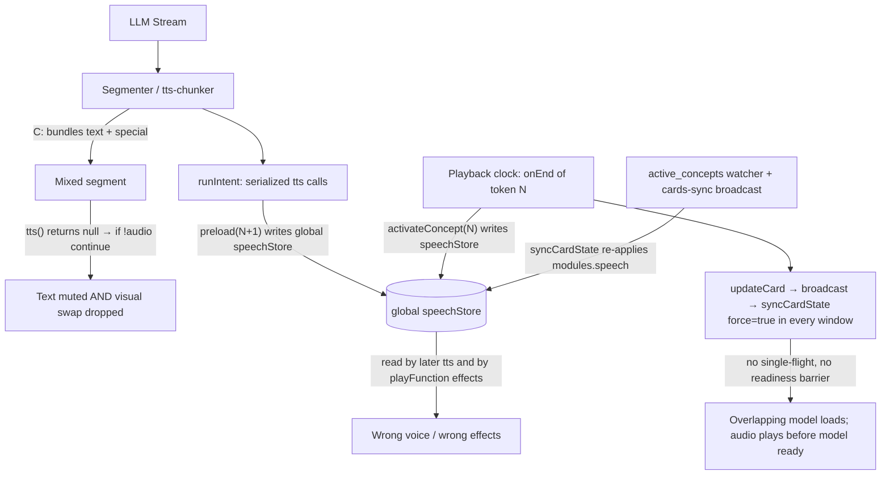

# Review Report: Root Cause Analysis Validation for `<|ACTOR:|>` Token Sync

> **Reviewed document:** [`docs/journal-actor-token-sync.md`](./journal-actor-token-sync.md)
> **Review date:** 2026-06-12
> **Method:** Line-by-line code trace of the speech pipeline, chunker, playback manager, artistry store, and card store. All line numbers below refer to the current working tree.

---

## 1. Verdict Summary

| Root Cause | Verdict | Notes |
|---|---|---|
| **A** — Global state pollution at generation time | **Partially valid** — conclusion correct, mechanism incorrect | The described race ("segment 1 still synthesizing when the tokenizer parses token B") cannot occur: TTS calls are strictly serialized inside `runIntent()`. The *real* race is the reverse direction: playback-time `activateConcept()` and async `syncCardState()` stomp the global voice state *back* over generation-time `preloadConceptVoice()`. |
| **B** — Playback vs. visual loading latency gap | **Valid** | Confirmed. The actor token playback item carries `audio: null`, completes instantly, and nothing awaits the model swap. (Minor nit: there is no function literally named `changeModel()`; the chain is `activateConcept → updateCard → active_concepts watcher → syncCardState → updateStageModel/shouldUpdateView`.) |
| **C** — Text-swallowing in the chunker | **Valid** — and *worse* than described | Confirmed. However the journal's claim that the text is "scheduled with `audio: null`" is wrong — the segment is **never scheduled at all** (`if (!audio) continue`). Consequence missed by the journal: the actor token bundled with that text also never reaches the playback queue, so **the visual swap for that token is silently dropped too**, not just the audio. |
| **D** — Broadcast loop & concurrency collisions | **Partially valid** | Overlapping, unserialized model-sync work is real. But (1) there is **no broadcast loop** — `loadCards()` never re-broadcasts, so the cycle terminates; and (2) the stage/actor window does **not** run a local playback queue (playback lives in the window hosting `ControlStripHost.vue`), so the specific "simultaneous local token + broadcast" collision described cannot happen as written. The actual collision is *N* rapid forced `syncCardState()` invocations with no single-flight guard. |

The document's symptoms are real and three of four arrows point at genuinely defective code. But two of the four *mechanisms* are misdiagnosed, which matters because a fix built on the written mechanism for A would not fix the bug.

---

## 2. Detailed Findings

### 2.1 Root Cause A — the written race is impossible; a different race exists

**What the journal claims:** while segment 1 ("Text for Actor A") is queued or mid-synthesis, the tokenizer parses Actor B's token and `preloadConceptVoice(B)` immediately mutates the store, so segment 1 is synthesized with B's voice (voice swaps *early*).

**What the code actually does:**

1. Segment processing is **strictly sequential**. `runIntent()` in `packages/pipelines-audio/src/speech-pipeline.ts:93-188` reads one segment at a time and `await`s `options.tts(request, signal)` (line 149) before reading the next segment. A special segment's `tts()` call (line 111) can only run *after* the preceding text segment's TTS has fully resolved.
2. Parsing does not mutate state. The marker parser / segmenter only tags segments; the speech-store mutation happens exclusively inside the host `tts()` handler (`ControlStripHost.vue:503-513`), which is serialized per point 1.
3. `preloadConceptVoice()` is **synchronous** (`artistry-autonomous.ts:1026-1065`), so even the "fire-and-forget" call at `ControlStripHost.vue:511` completes before `tts()` returns. There is no async preload gap.
4. Voice configuration is captured at the **top** of `tts()` (`ControlStripHost.vue:522-524`), before any `await`, so an in-flight synthesis cannot pick up a later mutation.

So within a single intent, "Actor A's text synthesized with Actor B's voice because the preload ran early" cannot happen.

**The race that does exist (and produces the same symptom):** generation runs *ahead* of playback (segments are scheduled and the loop continues; the playback manager drains at audio speed). Two writers mutate the same global `speechStore` on different clocks:

- **Generation clock:** `preloadConceptVoice(N+1)` sets the voice for the *next* actor's text (`artistry-autonomous.ts:1054-1061`).
- **Playback clock:** when actor token *N*'s null-audio item finishes, `playbackManager.onEnd` → `playSpecialToken` → queue `'actor'` handler (`ControlStripHost.vue:280-284`) → `activateConcept(N)`, which **also writes the speech store** (`artistry-autonomous.ts:981-987`).
- **Watcher clock:** `activateConcept` → `updateCard` → the `active_concepts` deep watcher (`airi-card.ts:333-340`) → `syncCardState(force=true)`, which *again* re-applies `modules.speech.*` to the global store asynchronously (`airi-card.ts:500-510`), and is additionally re-triggered in every window by the `airi:cards-sync` broadcast (`airi-card.ts:285-292`).

When playback (or the deferred watcher/broadcast) of actor *N* lands **after** generation has already preloaded actor *N+1*, the store is reset to *N*'s voice and *N+1*'s remaining text is synthesized with *N*'s voice. This is a **late/reverted** swap, the opposite direction of the journal's "early" swap, but observationally identical to the user ("audio segments spoken in the wrong voice", worse in rapid back-and-forth dialogue — exactly because the generation/playback skew grows there).

Secondary playback-time read of global state: `playFunction()` reads `activeSpeechProvider`/`activeSpeechVoice` at playback time to choose effects/pitch (`ControlStripHost.vue:414-427`). Even when the buffer was synthesized with the right voice, the wrong actor's effect chain/pitch can be applied at play time.

**Verdict:** the conclusion (a single global mutable voice state shared between the generation and playback clocks is the defect) is correct and the proposed fix direction is right. The narrative mechanism is wrong.

### 2.2 Root Cause B — confirmed

- Pure actor-token segments are scheduled as null-audio playback items (`speech-pipeline.ts:106-132`).
- `playFunction()` returns immediately for null audio (`ControlStripHost.vue:393-394`), so the playback manager fires `onEnd` and starts the next queued audio synchronously (`playback-manager.ts:126-147`).
- `onEnd` kicks off the swap asynchronously and nothing awaits it: `playSpecialToken` → queue handler → `void activateConcept(actorId)` (`ControlStripHost.vue:280-284`, `queues.ts:122-128`) → `updateCard` → watcher → `syncCardState` → `await updateStageModel()` / `shouldUpdateView()` (`airi-card.ts:513-545`). In Electron the model actually reloads in the separate actor window (`apps/stage-tamagotchi/src/renderer/pages/actor.vue`), adding broadcast latency on top of load time.

There is no readiness barrier anywhere in this chain. Actor B's audio starts while Actor A's model is still on screen. **Valid.**

### 2.3 Root Cause C — confirmed, with two corrections

Trace for input `"Hello <|ACTOR:character_b|>"`:

1. `chunkTtsInput()` accumulates `buffer = "Hello "`, hits `TTS_SPECIAL_TOKEN`, and yields `{ text: 'Hello', reason: 'special' }` (`tts-chunker.ts:141-155`). Bundling confirmed.
2. `chunkEmitter()` passes it through with the popped special token attached (`tts-chunker.ts:229-233`), producing a `TextSegment` with **both** `text: 'Hello'` and `special: '<|ACTOR:character_b|>'`.
3. In `runIntent()`, the dedicated special-segment branch requires `value.text === ''` (`speech-pipeline.ts:106`), so this mixed segment falls through to the normal TTS path.
4. The host `tts()` checks `request.special` **before** looking at the text and returns `null` (`ControlStripHost.vue:503-513`). The text is discarded.

**Correction 1:** the journal says the text "is scheduled with `audio: null`, resulting in silence". It is not scheduled at all — `if (!audio) continue` (`speech-pipeline.ts:161-162`) drops the segment entirely.

**Correction 2 (missed consequence):** because nothing is scheduled, the special token also never reaches the playback queue for this segment. The deferred playback-time activation (`onEnd → activateConcept`) **never fires for that token**. So in the bundled case the system mutes the preceding text *and* skips the visual model/background swap, while still having silently changed the voice via `preloadConceptVoice`. This single defect therefore explains a portion of all three symptom classes (muted text, missing/late visual swap, wrong voice persistence) — it is the strongest finding in the journal and the impact is understated.

**Verdict: valid.**

### 2.4 Root Cause D — collisions real, "loop" and location wrong

- `persistCards()` broadcasts `airi:cards-sync` after every card write (`airi-card.ts:294-304`); every window reloads cards (`airi-card.ts:287-292`); the deep `active_concepts` watcher then runs `syncCardState(card, force=true)` in **each** window (`airi-card.ts:333-340`).
- `syncCardState` is `async`, unguarded, and forced (`force=true` bypasses the `modelChanged` check at `airi-card.ts:513-521`). Rapid consecutive actor swaps produce overlapping `updateStageModel()` invocations with interleaved awaits and no cancellation/single-flight, in both the main and the actor window. Overlapping loads racing each other is a credible source of aborted/corrupted model state. This part stands.
- However: `loadCards()` only reads (`airi-card.ts:270-283`); it never calls `persistCards`, so there is **no broadcast loop** — one write fans out once per window and terminates.
- The journal's specific collision ("the stage window simultaneously processes the token from its local playback queue and receives a card update broadcast") is impossible as written: the playback queue lives in `ControlStripHost.vue`, which is mounted in the main window (`packages/stage-ui/src/components/scenes/index.ts:1`, exported as `WidgetStage`); the actor window mounts only `RendererStage` (`actor.vue:6,261`) and has no playback queue. The actor window's duplicate triggers come from the cards-sync broadcast + its own watcher, not from token playback.

**Verdict: partially valid** — right symptom (overlapping model loads), wrong topology and an overstated "loop".

### 2.5 Additional defects found during review (not in the journal)

1. **Dead event listener:** `speechPipeline.on('onSpecial', …)` (`ControlStripHost.vue:646-649`) never fires — `speechSpecialEvent` is defined in `eventa.ts:14` but `speech-pipeline.ts` never emits it. The `(parser)` label on the `'actor'` handler (`ControlStripHost.vue:280-281`) is therefore misleading: in practice that handler runs at *playback* time, fed exclusively via `playbackManager.onEnd`. `parserActorId` is effectively a duplicate of `playbackActorId`.
2. **`activateConcept` has a dual personality:** it performs the *visual* swap (correct for playback time) but also rewrites the *speech* runtime (`artistry-autonomous.ts:981-987`) — which belongs to the generation clock. This duality is the heart of the real Root Cause A race and must be split regardless of which fix plan is adopted.
3. **`syncCardState` re-applies speech config asynchronously** (`airi-card.ts:500-510`) after every card write, providing a second, delayed writer to the global voice state with unpredictable timing relative to TTS generation.
4. **Mixed text+special segments are representable in the type system** (`TextSegment` carries both `text` and `special`), but only one consumer branch (`speech-pipeline.ts:106`) handles specials, and only for the empty-text case. Even after a chunker fix, the pipeline should defensively handle (or statically forbid) the mixed shape.

---

## 3. Review of the Proposed Architectural Rework

### 3.1 Proposal 1 — Scoped/metadata-driven segment synthesis: **agree, and go further**

Correct fix and the highest-leverage one. Recommended shape:

- Tag every `TextSegment` with an `actorId` at segmentation time (the chunker already tracks specials; it can carry forward "current actor" context onto subsequent literal segments).
- In the host `tts()`, resolve `{provider, model, voiceId}` from the segment's `actorId` via a pure lookup (`resolveConceptStack` + `foldConceptStack` are already pure functions and can be reused as-is), never from `speechStore`.
- Delete `preloadConceptVoice()` entirely — with per-segment resolution there is nothing to preload.
- Remove the speech-store writes from `activateConcept()` (`artistry-autonomous.ts:981-987`); the global store should only mirror the *currently playing* actor for UI display, written from `playbackManager.onStart` using the segment's `actorId`.
- Pass the resolved voice/effects profile on the `PlaybackItem` as well, so `playFunction()` (`ControlStripHost.vue:414-427`) stops reading global state at playback time. The journal's proposal omits this playback-side read; fixing only generation leaves wrong effect-chains/pitch.

This also fixes caption coloring for free (use `item.actorId` instead of the `playbackActorId` ref guess).

### 3.2 Proposal 2 — Playback synchronization barrier: **agree with the goal, different implementation**

A barrier is right, but "pause the queue, swap, wait for `onModelReady`, resume" adds new queue states and a hard 2–5 s of dead air on every swap. Two amendments:

1. **Implement the barrier inside `playFunction` instead of new queue machinery.** The playback manager already serializes items (`maxVoices: 1`). If the special item's `play()` simply *awaits* `activateConcept(actorId)` plus a model-ready promise (with a 5–8 s timeout fallback), the queue blocks naturally — no pause/resume API, no new states, abort-signal handling comes for free. The `onModelReady` event from `RendererStage.vue` is still needed, but the consumer is a one-line `await`.
2. **Prefetch at generation time to shrink the barrier.** When the special segment passes through generation (where `preloadConceptVoice` is today), kick off a *non-mutating* model prefetch (resolve `displayModelId`, warm the asset/blob cache) so that by the time playback reaches the token, the load is mostly done and the barrier usually resolves in milliseconds. Generation runs seconds ahead of playback, which is exactly the budget a prefetch needs. The journal's plan discards this lead time.

### 3.3 Proposal 3 — Strict token isolation in chunker: **agree**

Correct and minimal: on `TTS_SPECIAL_TOKEN`, flush the buffer as a pure literal chunk, then emit an empty special chunk (`tts-chunker.ts:141-155` is the edit site). Note the ordering benefit: "Hello" belongs to the *previous* actor, so isolating it ensures it is synthesized with the previous actor's voice — bundling could never be fixed by synthesizing the mixed chunk, only by splitting it.

Two additions:

- Add a defensive branch in `speech-pipeline.ts` (or narrow the `TextSegment` type) so a mixed text+special segment can never silently vanish again; at minimum, synthesize the text and schedule the special separately.
- Add unit tests in `packages/pipelines-audio` for the chunker (`"Hello <|ACTOR:b|>"`, `"<|ACTOR:a|>Hi<|ACTOR:b|>"`, punctuation-adjacent cases) — this code is pure and trivially testable with Vitest.

### 3.4 What the rework plan is missing

The plan has no item addressing Root Cause D's actual defect. Required regardless of the rest:

1. **Single-flight + cancellation for `syncCardState`/model loads:** keep a generation counter or `AbortController` per window; a newer sync cancels the in-flight one (`airi-card.ts:480-547`).
2. **Stop force-syncing speech from the card watcher** (`airi-card.ts:500-510`) once voice resolution is per-segment — otherwise the watcher reintroduces the global-state stomp the rework removes.
3. **Delete the dead `onSpecial` wiring** (`ControlStripHost.vue:646-649`) or actually emit the event from the pipeline; either way remove the misleading `(parser)` path so there is exactly one documented activation route (playback).

### 3.5 Would I take the same path?

**Yes on direction, with re-sequenced priorities.** Rebuild-vs-patch framing in the journal slightly oversells the scope: items 1 and 3 are localized refactors of pure functions and one handler, not a pipeline revamp. My ordering, by payoff per risk:

1. **Chunker isolation + defensive pipeline branch (C)** — small, pure, testable; immediately eliminates muted text *and* dropped visual swaps.
2. **Per-segment actor metadata and voice resolution (A)** — removes the global-state writers (`preloadConceptVoice`, `activateConcept`'s speech writes, watcher speech sync); this is the structural fix.
3. **Playback barrier in `playFunction` + generation-time prefetch (B)** — needs the `onModelReady` event in the renderer and an Electron broadcast ack for the actor window; the most cross-cutting item, do it once 1–2 have stabilized the data flow.
4. **Single-flight model sync (D)** — a contained guard in `airi-card.ts`, can be done any time, but is masked until 3 lands.

The one design point where I'd explicitly diverge: do **not** introduce a pause/resume API on the playback manager (journal's Proposal 2 as written). Making the special item's `play()` awaitable keeps the playback manager's contract unchanged and avoids a new class of stuck-queue bugs if a resume is missed on abort/interrupt paths.

---

## 4. Corrected Failure-Flow Diagram

---

## 5. File Reference Manifest (verified line numbers)

| Concern | File | Lines |
|---|---|---|
| Serialized segment loop, empty-special branch, `if (!audio) continue` | `packages/pipelines-audio/src/speech-pipeline.ts` | 93–188, 106, 161–162 |
| Text+special bundling | `packages/pipelines-audio/src/processors/tts-chunker.ts` | 141–155, 229–233 |
| `tts()` special short-circuit, global voice reads, playback effects reads | `packages/stage-ui/src/components/scenes/ControlStripHost.vue` | 503–513, 522–524, 414–427 |
| Dead `onSpecial` listener; `'actor'` queue handler | `packages/stage-ui/src/components/scenes/ControlStripHost.vue` | 646–649, 280–284, 651–680 |
| Null-audio instant completion | `packages/stage-ui/src/components/scenes/ControlStripHost.vue` / `packages/pipelines-audio/src/managers/playback-manager.ts` | 393–394 / 126–147 |
| `activateConcept` speech writes; `preloadConceptVoice` | `packages/stage-ui/src/stores/modules/artistry-autonomous.ts` | 981–987, 1026–1065 |
| cards-sync broadcast, reload, `active_concepts` watcher, forced `syncCardState` speech/model sync | `packages/stage-ui/src/stores/modules/airi-card.ts` | 285–304, 333–340, 480–547 |
| Actor window renderer (no playback queue) | `apps/stage-tamagotchi/src/renderer/pages/actor.vue` | 6, 261 |
